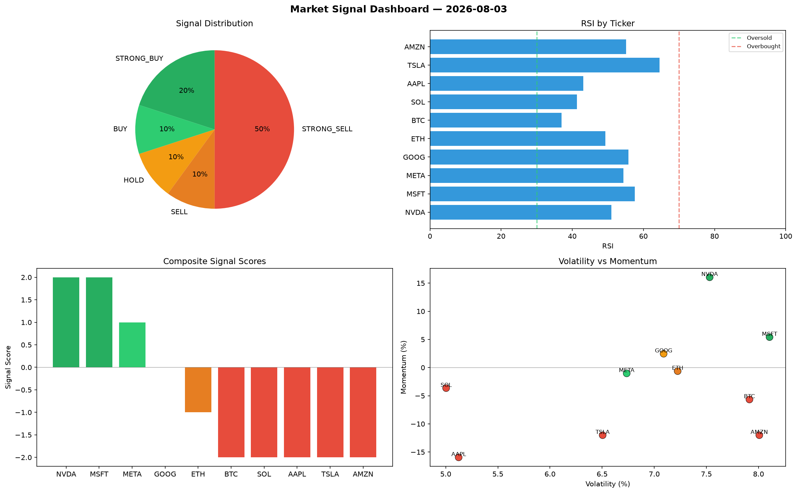

# Market Signal Report — 2026-08-03

**Run ID:** `6b85d56239` | **Buy:** 3 | **Sell:** 6 | **Hold:** 1

## Signal Dashboard

| Ticker | Price | Signal | Score | RSI | Momentum | Confidence |
|--------|-------|--------|-------|-----|----------|------------|
| NVDA | $2097.88 | **STRONG_BUY** | 2 | 51.02 | 0.1604 | 0.5 |
| MSFT | $3517.39 | **STRONG_BUY** | 2 | 57.62 | 0.0541 | 0.5 |
| META | $971.87 | **BUY** | 1 | 54.37 | -0.0103 | 0.25 |
| GOOG | $2202.64 | **HOLD** | 0 | 55.81 | 0.0246 | 0.0 |
| ETH | $4820.78 | **SELL** | -1 | 49.3 | -0.0063 | 0.25 |
| BTC | $641.67 | **STRONG_SELL** | -2 | 37.03 | -0.0567 | 0.5 |
| SOL | $1894.25 | **STRONG_SELL** | -2 | 41.27 | -0.0365 | 0.5 |
| AAPL | $3994.62 | **STRONG_SELL** | -2 | 43.09 | -0.1595 | 0.5 |
| TSLA | $137.41 | **STRONG_SELL** | -2 | 64.5 | -0.1201 | 0.5 |
| AMZN | $4352.91 | **STRONG_SELL** | -2 | 55.11 | -0.1201 | 0.5 |

## Delta vs Yesterday

| Ticker | Today | Yesterday | Price Change | Signal Changed |
|--------|-------|-----------|-------------|----------------|
| NVDA | STRONG_BUY | BUY | 📈 3392.97% | ⚠️ YES |
| MSFT | STRONG_BUY | BUY | 📈 21.76% | ⚠️ YES |
| META | BUY | SELL | 📉 -70.55% | ⚠️ YES |
| GOOG | HOLD | STRONG_BUY | 📉 -20.63% | ⚠️ YES |
| ETH | SELL | STRONG_SELL | 📈 540.34% | ⚠️ YES |
| BTC | STRONG_SELL | STRONG_BUY | 📈 309.86% | ⚠️ YES |
| SOL | STRONG_SELL | BUY | 📈 92.82% | ⚠️ YES |
| AAPL | STRONG_SELL | HOLD | 📈 39.18% | ⚠️ YES |
| TSLA | STRONG_SELL | SELL | 📉 -96.71% | ⚠️ YES |
| AMZN | STRONG_SELL | BUY | 📉 -11.69% | ⚠️ YES |