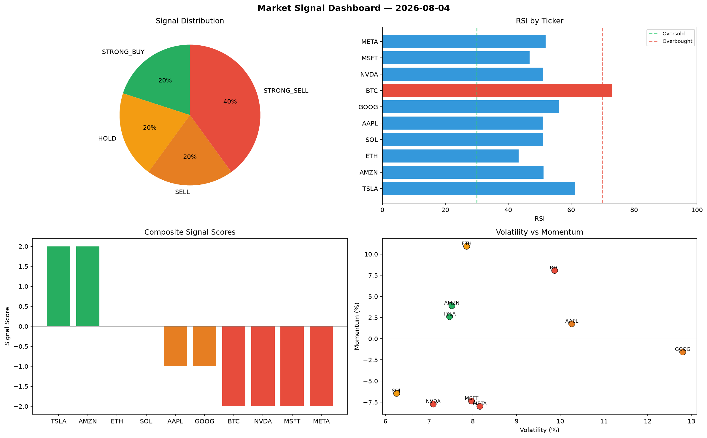

# Market Signal Report — 2026-08-04

**Run ID:** `403c03694c` | **Buy:** 2 | **Sell:** 6 | **Hold:** 2

## Signal Dashboard

| Ticker | Price | Signal | Score | RSI | Momentum | Confidence |
|--------|-------|--------|-------|-----|----------|------------|
| TSLA | $3044.25 | **STRONG_BUY** | 2 | 61.2 | 0.026 | 0.5 |
| AMZN | $355.08 | **STRONG_BUY** | 2 | 51.25 | 0.039 | 0.5 |
| ETH | $5199.45 | **HOLD** | 0 | 43.29 | 0.1092 | 0.0 |
| SOL | $872.75 | **HOLD** | 0 | 51.11 | -0.0647 | 0.0 |
| AAPL | $4084.33 | **SELL** | -1 | 50.92 | 0.0176 | 0.25 |
| GOOG | $3887.87 | **SELL** | -1 | 56.18 | -0.0157 | 0.25 |
| BTC | $4134.42 | **STRONG_SELL** | -2 | 73.15 | 0.0807 | 0.5 |
| NVDA | $1903.83 | **STRONG_SELL** | -2 | 51.09 | -0.0773 | 0.5 |
| MSFT | $2362.15 | **STRONG_SELL** | -2 | 46.76 | -0.0737 | 0.5 |
| META | $1171.69 | **STRONG_SELL** | -2 | 51.9 | -0.08 | 0.5 |

## Delta vs Yesterday

| Ticker | Today | Yesterday | Price Change | Signal Changed |
|--------|-------|-----------|-------------|----------------|
| TSLA | STRONG_BUY | BUY | 📈 121.68% | ⚠️ YES |
| AMZN | STRONG_BUY | STRONG_BUY | 📉 -93.17% | — |
| ETH | HOLD | STRONG_SELL | 📈 1325.41% | ⚠️ YES |
| SOL | HOLD | STRONG_BUY | 📉 -67.19% | ⚠️ YES |
| AAPL | SELL | BUY | 📉 -11.29% | ⚠️ YES |
| GOOG | SELL | STRONG_BUY | 📈 2626.03% | ⚠️ YES |
| BTC | STRONG_SELL | BUY | 📈 36.17% | ⚠️ YES |
| NVDA | STRONG_SELL | HOLD | 📈 41.27% | ⚠️ YES |
| MSFT | STRONG_SELL | HOLD | 📉 -19.7% | ⚠️ YES |
| META | STRONG_SELL | HOLD | 📉 -63.94% | ⚠️ YES |