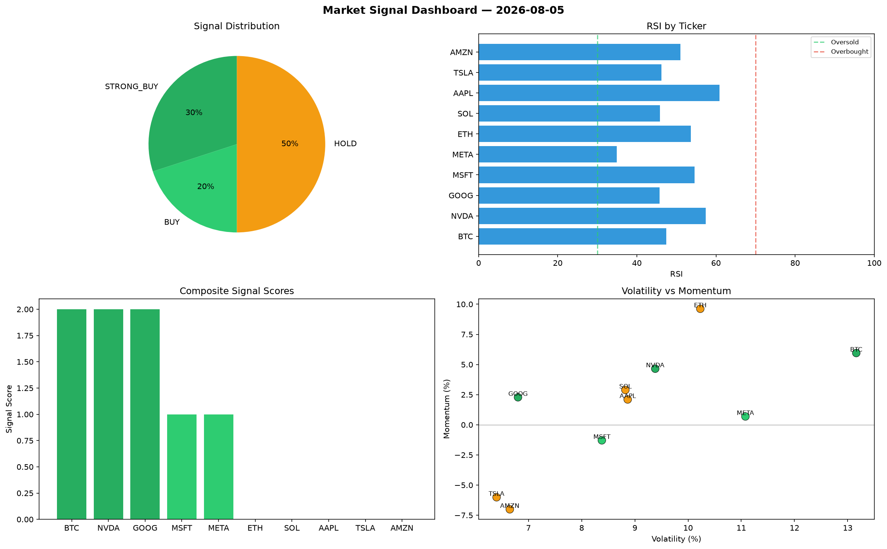

# Market Signal Report — 2026-08-05

**Run ID:** `6e13dca08f` | **Buy:** 5 | **Sell:** 0 | **Hold:** 5

## Signal Dashboard

| Ticker | Price | Signal | Score | RSI | Momentum | Confidence |
|--------|-------|--------|-------|-----|----------|------------|
| BTC | $1760.51 | **STRONG_BUY** | 2 | 47.47 | 0.0595 | 0.5 |
| NVDA | $3448.55 | **STRONG_BUY** | 2 | 57.45 | 0.0465 | 0.5 |
| GOOG | $564.39 | **STRONG_BUY** | 2 | 45.73 | 0.0228 | 0.5 |
| MSFT | $2609.31 | **BUY** | 1 | 54.63 | -0.0129 | 0.25 |
| META | $2623.27 | **BUY** | 1 | 34.91 | 0.0069 | 0.25 |
| ETH | $1978.13 | **HOLD** | 0 | 53.69 | 0.0962 | 0.0 |
| SOL | $4543.19 | **HOLD** | 0 | 45.86 | 0.0289 | 0.0 |
| AAPL | $2498.25 | **HOLD** | 0 | 60.92 | 0.021 | 0.0 |
| TSLA | $4008.72 | **HOLD** | 0 | 46.19 | -0.0601 | 0.0 |
| AMZN | $1493.64 | **HOLD** | 0 | 51.04 | -0.0701 | 0.0 |

## Delta vs Yesterday

| Ticker | Today | Yesterday | Price Change | Signal Changed |
|--------|-------|-----------|-------------|----------------|
| BTC | STRONG_BUY | HOLD | 📉 -41.12% | ⚠️ YES |
| NVDA | STRONG_BUY | STRONG_BUY | 📉 -2.07% | — |
| GOOG | STRONG_BUY | STRONG_BUY | 📉 -42.72% | — |
| MSFT | BUY | STRONG_BUY | 📉 -40.05% | ⚠️ YES |
| META | BUY | STRONG_BUY | 📉 -39.87% | ⚠️ YES |
| ETH | HOLD | STRONG_SELL | 📈 117.63% | ⚠️ YES |
| SOL | HOLD | STRONG_BUY | 📉 -4.82% | ⚠️ YES |
| AAPL | HOLD | STRONG_SELL | 📉 -26.53% | ⚠️ YES |
| TSLA | HOLD | HOLD | 📈 14.7% | — |
| AMZN | HOLD | HOLD | 📈 20.49% | — |