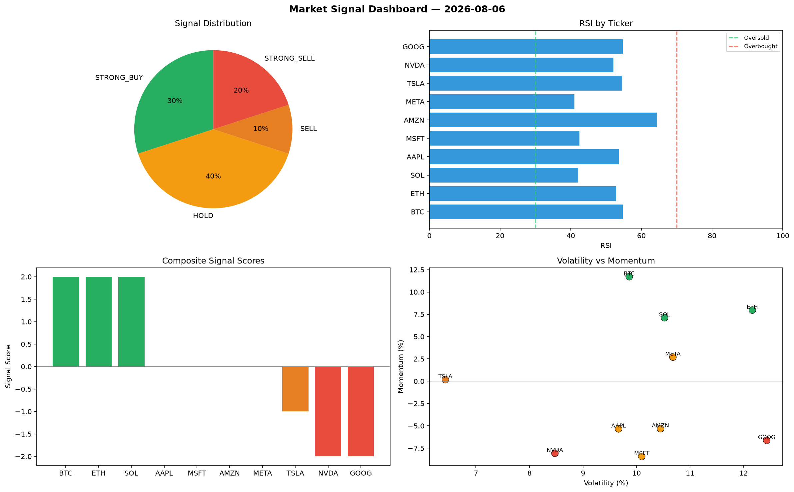

# Market Signal Report — 2026-08-06

**Run ID:** `56a09d5045` | **Buy:** 3 | **Sell:** 3 | **Hold:** 4

## Signal Dashboard

| Ticker | Price | Signal | Score | RSI | Momentum | Confidence |
|--------|-------|--------|-------|-----|----------|------------|
| BTC | $3257.57 | **STRONG_BUY** | 2 | 54.7 | 0.1171 | 0.5 |
| ETH | $1266.19 | **STRONG_BUY** | 2 | 52.85 | 0.0797 | 0.5 |
| SOL | $4326.48 | **STRONG_BUY** | 2 | 42.07 | 0.0712 | 0.5 |
| AAPL | $3095.13 | **HOLD** | 0 | 53.66 | -0.0534 | 0.0 |
| MSFT | $3328.44 | **HOLD** | 0 | 42.43 | -0.0843 | 0.0 |
| AMZN | $4706.57 | **HOLD** | 0 | 64.44 | -0.0532 | 0.0 |
| META | $4479.33 | **HOLD** | 0 | 41.04 | 0.027 | 0.0 |
| TSLA | $1803.5 | **SELL** | -1 | 54.58 | 0.0018 | 0.25 |
| NVDA | $1802.72 | **STRONG_SELL** | -2 | 52.04 | -0.0807 | 0.5 |
| GOOG | $964.98 | **STRONG_SELL** | -2 | 54.75 | -0.0663 | 0.5 |

## Delta vs Yesterday

| Ticker | Today | Yesterday | Price Change | Signal Changed |
|--------|-------|-----------|-------------|----------------|
| BTC | STRONG_BUY | BUY | 📉 -13.34% | ⚠️ YES |
| ETH | STRONG_BUY | STRONG_SELL | 📉 -2.17% | ⚠️ YES |
| SOL | STRONG_BUY | BUY | 📈 218.61% | ⚠️ YES |
| AAPL | HOLD | STRONG_SELL | 📈 1946.64% | ⚠️ YES |
| MSFT | HOLD | BUY | 📉 -1.89% | ⚠️ YES |
| AMZN | HOLD | SELL | 📈 47.36% | ⚠️ YES |
| META | HOLD | HOLD | 📈 42.21% | — |
| TSLA | SELL | STRONG_BUY | 📉 -44.5% | ⚠️ YES |
| NVDA | STRONG_SELL | BUY | 📈 35.0% | ⚠️ YES |
| GOOG | STRONG_SELL | STRONG_SELL | 📉 -58.07% | — |