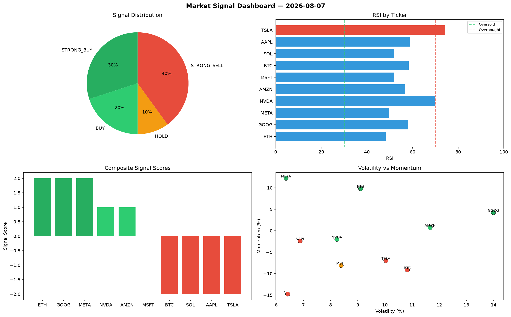

# Market Signal Report — 2026-08-07

**Run ID:** `8e2d7264e4` | **Buy:** 5 | **Sell:** 4 | **Hold:** 1

## Signal Dashboard

| Ticker | Price | Signal | Score | RSI | Momentum | Confidence |
|--------|-------|--------|-------|-----|----------|------------|
| ETH | $1697.09 | **STRONG_BUY** | 2 | 48.3 | 0.0981 | 0.5 |
| GOOG | $2078.42 | **STRONG_BUY** | 2 | 57.97 | 0.0424 | 0.5 |
| META | $2756.2 | **STRONG_BUY** | 2 | 49.8 | 0.1222 | 0.5 |
| NVDA | $3733.0 | **BUY** | 1 | 69.87 | -0.02 | 0.25 |
| AMZN | $1496.58 | **BUY** | 1 | 56.87 | 0.0073 | 0.25 |
| MSFT | $4874.84 | **HOLD** | 0 | 51.91 | -0.0809 | 0.0 |
| BTC | $1063.41 | **STRONG_SELL** | -2 | 58.35 | -0.0915 | 0.5 |
| SOL | $447.74 | **STRONG_SELL** | -2 | 51.89 | -0.1477 | 0.5 |
| AAPL | $2253.51 | **STRONG_SELL** | -2 | 58.83 | -0.024 | 0.5 |
| TSLA | $1560.26 | **STRONG_SELL** | -2 | 74.28 | -0.0697 | 0.5 |

## Delta vs Yesterday

| Ticker | Today | Yesterday | Price Change | Signal Changed |
|--------|-------|-----------|-------------|----------------|
| ETH | STRONG_BUY | STRONG_BUY | 📈 16.92% | — |
| GOOG | STRONG_BUY | SELL | 📉 -53.96% | ⚠️ YES |
| META | STRONG_BUY | HOLD | 📈 158.75% | ⚠️ YES |
| NVDA | BUY | STRONG_SELL | 📉 -0.7% | ⚠️ YES |
| AMZN | BUY | HOLD | 📉 -38.48% | ⚠️ YES |
| MSFT | HOLD | HOLD | 📈 4.86% | — |
| BTC | STRONG_SELL | STRONG_SELL | 📉 -68.95% | — |
| SOL | STRONG_SELL | STRONG_SELL | 📉 -90.19% | — |
| AAPL | STRONG_SELL | HOLD | 📈 49.02% | ⚠️ YES |
| TSLA | STRONG_SELL | STRONG_SELL | 📉 -53.68% | — |