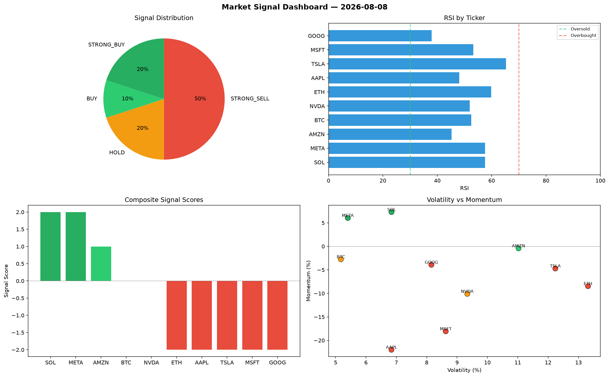

# Market Signal Report — 2026-08-08

**Run ID:** `fbff5f4110` | **Buy:** 3 | **Sell:** 5 | **Hold:** 2

## Signal Dashboard

| Ticker | Price | Signal | Score | RSI | Momentum | Confidence |
|--------|-------|--------|-------|-----|----------|------------|
| SOL | $1259.66 | **STRONG_BUY** | 2 | 57.58 | 0.073 | 0.5 |
| META | $670.63 | **STRONG_BUY** | 2 | 57.61 | 0.0604 | 0.5 |
| AMZN | $1788.34 | **BUY** | 1 | 45.3 | -0.0042 | 0.25 |
| BTC | $4655.75 | **HOLD** | 0 | 52.47 | -0.0275 | 0.0 |
| NVDA | $1661.34 | **HOLD** | 0 | 51.91 | -0.101 | 0.0 |
| ETH | $2161.48 | **STRONG_SELL** | -2 | 59.81 | -0.0846 | 0.5 |
| AAPL | $1891.41 | **STRONG_SELL** | -2 | 48.05 | -0.2199 | 0.5 |
| TSLA | $4572.49 | **STRONG_SELL** | -2 | 65.26 | -0.047 | 0.5 |
| MSFT | $2209.31 | **STRONG_SELL** | -2 | 53.26 | -0.1807 | 0.5 |
| GOOG | $2069.93 | **STRONG_SELL** | -2 | 37.91 | -0.0392 | 0.5 |

## Delta vs Yesterday

| Ticker | Today | Yesterday | Price Change | Signal Changed |
|--------|-------|-----------|-------------|----------------|
| SOL | STRONG_BUY | STRONG_BUY | 📉 -55.23% | — |
| META | STRONG_BUY | HOLD | 📉 -81.49% | ⚠️ YES |
| AMZN | BUY | SELL | 📉 -11.78% | ⚠️ YES |
| BTC | HOLD | SELL | 📈 10.14% | ⚠️ YES |
| NVDA | HOLD | STRONG_BUY | 📉 -60.89% | ⚠️ YES |
| ETH | STRONG_SELL | STRONG_SELL | 📉 -28.31% | — |
| AAPL | STRONG_SELL | HOLD | 📈 5.07% | ⚠️ YES |
| TSLA | STRONG_SELL | STRONG_BUY | 📈 3560.63% | ⚠️ YES |
| MSFT | STRONG_SELL | HOLD | 📈 121.19% | ⚠️ YES |
| GOOG | STRONG_SELL | SELL | 📈 751.33% | ⚠️ YES |