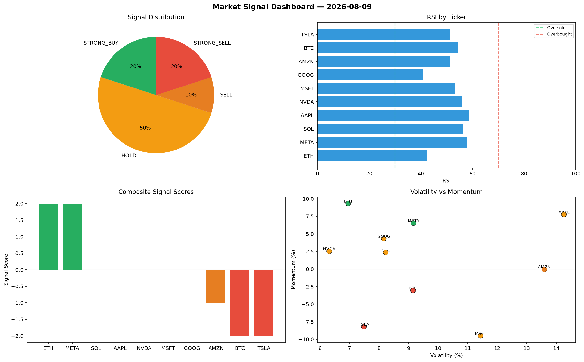

# Market Signal Report — 2026-08-09

**Run ID:** `88fb095f36` | **Buy:** 2 | **Sell:** 3 | **Hold:** 5

## Signal Dashboard

| Ticker | Price | Signal | Score | RSI | Momentum | Confidence |
|--------|-------|--------|-------|-----|----------|------------|
| ETH | $3920.61 | **STRONG_BUY** | 2 | 42.48 | 0.0931 | 0.5 |
| META | $545.97 | **STRONG_BUY** | 2 | 57.82 | 0.0653 | 0.5 |
| SOL | $1585.8 | **HOLD** | 0 | 56.26 | 0.0236 | 0.0 |
| AAPL | $3794.66 | **HOLD** | 0 | 58.71 | 0.0776 | 0.0 |
| NVDA | $1835.78 | **HOLD** | 0 | 55.86 | 0.0253 | 0.0 |
| MSFT | $1682.26 | **HOLD** | 0 | 53.24 | -0.095 | 0.0 |
| GOOG | $2938.96 | **HOLD** | 0 | 40.93 | 0.0432 | 0.0 |
| AMZN | $3725.0 | **SELL** | -1 | 51.35 | -0.0004 | 0.25 |
| BTC | $3212.85 | **STRONG_SELL** | -2 | 54.2 | -0.0304 | 0.5 |
| TSLA | $1267.09 | **STRONG_SELL** | -2 | 51.17 | -0.082 | 0.5 |

## Delta vs Yesterday

| Ticker | Today | Yesterday | Price Change | Signal Changed |
|--------|-------|-----------|-------------|----------------|
| ETH | STRONG_BUY | HOLD | 📉 -10.01% | ⚠️ YES |
| META | STRONG_BUY | BUY | 📉 -80.36% | ⚠️ YES |
| SOL | HOLD | STRONG_BUY | 📈 45.09% | ⚠️ YES |
| AAPL | HOLD | HOLD | 📈 8440.76% | — |
| NVDA | HOLD | HOLD | 📈 7.77% | — |
| MSFT | HOLD | BUY | 📈 152.92% | ⚠️ YES |
| GOOG | HOLD | STRONG_SELL | 📉 -27.31% | ⚠️ YES |
| AMZN | SELL | STRONG_BUY | 📈 105.4% | ⚠️ YES |
| BTC | STRONG_SELL | STRONG_BUY | 📈 1087.22% | ⚠️ YES |
| TSLA | STRONG_SELL | HOLD | 📉 -34.86% | ⚠️ YES |