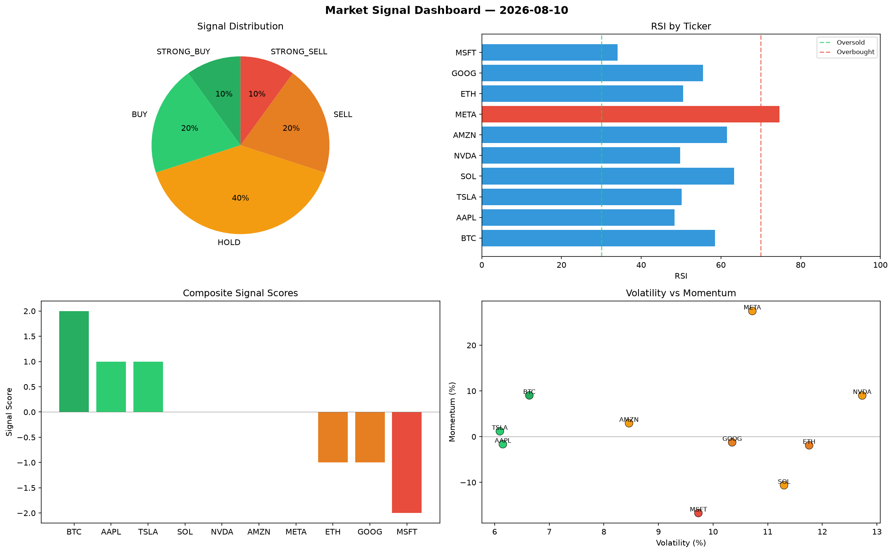

# Market Signal Report — 2026-08-10

**Run ID:** `383d6205c9` | **Buy:** 3 | **Sell:** 3 | **Hold:** 4

## Signal Dashboard

| Ticker | Price | Signal | Score | RSI | Momentum | Confidence |
|--------|-------|--------|-------|-----|----------|------------|
| BTC | $1235.28 | **STRONG_BUY** | 2 | 58.54 | 0.0903 | 0.5 |
| AAPL | $178.71 | **BUY** | 1 | 48.37 | -0.0165 | 0.25 |
| TSLA | $4521.07 | **BUY** | 1 | 50.11 | 0.0118 | 0.25 |
| SOL | $2170.49 | **HOLD** | 0 | 63.27 | -0.1063 | 0.0 |
| NVDA | $2976.97 | **HOLD** | 0 | 49.79 | 0.0901 | 0.0 |
| AMZN | $5215.36 | **HOLD** | 0 | 61.57 | 0.0294 | 0.0 |
| META | $4382.95 | **HOLD** | 0 | 74.69 | 0.2749 | 0.0 |
| ETH | $1601.8 | **SELL** | -1 | 50.56 | -0.0189 | 0.25 |
| GOOG | $2793.1 | **SELL** | -1 | 55.5 | -0.0124 | 0.25 |
| MSFT | $3751.05 | **STRONG_SELL** | -2 | 34.07 | -0.1671 | 0.5 |

## Delta vs Yesterday

| Ticker | Today | Yesterday | Price Change | Signal Changed |
|--------|-------|-----------|-------------|----------------|
| BTC | STRONG_BUY | SELL | 📈 40.66% | ⚠️ YES |
| AAPL | BUY | HOLD | 📉 -95.61% | ⚠️ YES |
| TSLA | BUY | SELL | 📈 24.44% | ⚠️ YES |
| SOL | HOLD | HOLD | 📉 -9.06% | — |
| NVDA | HOLD | HOLD | 📈 53.3% | — |
| AMZN | HOLD | HOLD | 📈 21.48% | — |
| META | HOLD | STRONG_SELL | 📈 153.28% | ⚠️ YES |
| ETH | SELL | STRONG_BUY | 📈 157.1% | ⚠️ YES |
| GOOG | SELL | HOLD | 📉 -23.29% | ⚠️ YES |
| MSFT | STRONG_SELL | STRONG_BUY | 📈 201.96% | ⚠️ YES |