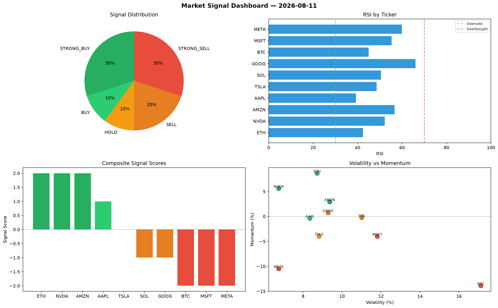

# Market Signal Report — 2026-08-11

**Run ID:** `abcefbcf2b` | **Buy:** 4 | **Sell:** 5 | **Hold:** 1

## Signal Dashboard

| Ticker | Price | Signal | Score | RSI | Momentum | Confidence |
|--------|-------|--------|-------|-----|----------|------------|
| ETH | $4890.69 | **STRONG_BUY** | 2 | 42.48 | 0.0868 | 0.5 |
| NVDA | $1558.34 | **STRONG_BUY** | 2 | 52.23 | 0.0561 | 0.5 |
| AMZN | $3024.05 | **STRONG_BUY** | 2 | 56.61 | 0.0293 | 0.5 |
| AAPL | $4443.32 | **BUY** | 1 | 39.28 | -0.004 | 0.25 |
| TSLA | $2080.22 | **HOLD** | 0 | 48.59 | -0.0396 | 0.0 |
| SOL | $2579.8 | **SELL** | -1 | 50.49 | -0.0022 | 0.25 |
| GOOG | $638.25 | **SELL** | -1 | 66.06 | 0.0075 | 0.25 |
| BTC | $304.33 | **STRONG_SELL** | -2 | 44.94 | -0.139 | 0.5 |
| MSFT | $4742.97 | **STRONG_SELL** | -2 | 55.31 | -0.04 | 0.5 |
| META | $2797.42 | **STRONG_SELL** | -2 | 59.94 | -0.1049 | 0.5 |

## Delta vs Yesterday

| Ticker | Today | Yesterday | Price Change | Signal Changed |
|--------|-------|-----------|-------------|----------------|
| ETH | STRONG_BUY | STRONG_SELL | 📈 54.23% | ⚠️ YES |
| NVDA | STRONG_BUY | BUY | 📈 7.52% | ⚠️ YES |
| AMZN | STRONG_BUY | SELL | 📉 -14.46% | ⚠️ YES |
| AAPL | BUY | STRONG_SELL | 📈 227.8% | ⚠️ YES |
| TSLA | HOLD | STRONG_BUY | 📉 -53.25% | ⚠️ YES |
| SOL | SELL | HOLD | 📉 -53.31% | ⚠️ YES |
| GOOG | SELL | STRONG_SELL | 📉 -59.34% | ⚠️ YES |
| BTC | STRONG_SELL | HOLD | 📉 -90.3% | ⚠️ YES |
| MSFT | STRONG_SELL | STRONG_SELL | 📈 1194.58% | — |
| META | STRONG_SELL | STRONG_BUY | 📉 -5.6% | ⚠️ YES |