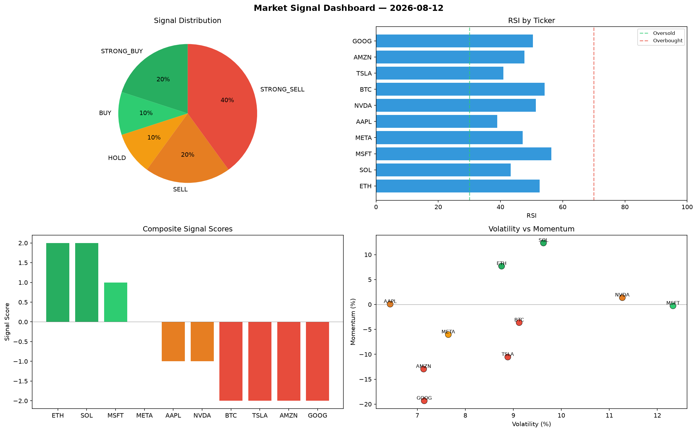

# Market Signal Report — 2026-08-12

**Run ID:** `5769aad946` | **Buy:** 3 | **Sell:** 6 | **Hold:** 1

## Signal Dashboard

| Ticker | Price | Signal | Score | RSI | Momentum | Confidence |
|--------|-------|--------|-------|-----|----------|------------|
| ETH | $421.44 | **STRONG_BUY** | 2 | 52.61 | 0.0769 | 0.5 |
| SOL | $4864.78 | **STRONG_BUY** | 2 | 43.31 | 0.1234 | 0.5 |
| MSFT | $2541.12 | **BUY** | 1 | 56.33 | -0.0027 | 0.25 |
| META | $790.85 | **HOLD** | 0 | 47.16 | -0.0604 | 0.0 |
| AAPL | $3306.69 | **SELL** | -1 | 38.93 | 0.0007 | 0.25 |
| NVDA | $524.28 | **SELL** | -1 | 51.37 | 0.0137 | 0.25 |
| BTC | $1014.84 | **STRONG_SELL** | -2 | 54.23 | -0.0364 | 0.5 |
| TSLA | $3200.84 | **STRONG_SELL** | -2 | 40.93 | -0.1055 | 0.5 |
| AMZN | $976.35 | **STRONG_SELL** | -2 | 47.73 | -0.1296 | 0.5 |
| GOOG | $3757.14 | **STRONG_SELL** | -2 | 50.44 | -0.1933 | 0.5 |

## Delta vs Yesterday

| Ticker | Today | Yesterday | Price Change | Signal Changed |
|--------|-------|-----------|-------------|----------------|
| ETH | STRONG_BUY | HOLD | 📉 -68.22% | ⚠️ YES |
| SOL | STRONG_BUY | STRONG_BUY | 📈 42.65% | — |
| MSFT | BUY | STRONG_SELL | 📈 25.46% | ⚠️ YES |
| META | HOLD | STRONG_SELL | 📉 -63.22% | ⚠️ YES |
| AAPL | SELL | STRONG_BUY | 📉 -29.27% | ⚠️ YES |
| NVDA | SELL | STRONG_BUY | 📉 -79.37% | ⚠️ YES |
| BTC | STRONG_SELL | HOLD | 📉 -44.27% | ⚠️ YES |
| TSLA | STRONG_SELL | BUY | 📈 666.01% | ⚠️ YES |
| AMZN | STRONG_SELL | BUY | 📉 -69.9% | ⚠️ YES |
| GOOG | STRONG_SELL | BUY | 📈 5.51% | ⚠️ YES |