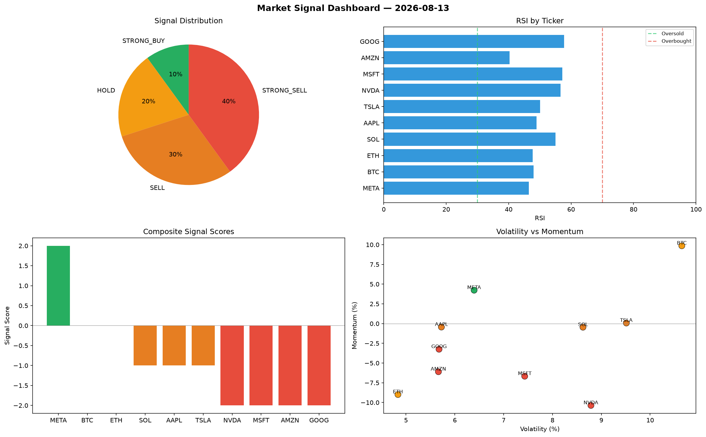

# Market Signal Report — 2026-08-13

**Run ID:** `b326492d15` | **Buy:** 1 | **Sell:** 7 | **Hold:** 2

## Signal Dashboard

| Ticker | Price | Signal | Score | RSI | Momentum | Confidence |
|--------|-------|--------|-------|-----|----------|------------|
| META | $4724.0 | **STRONG_BUY** | 2 | 46.48 | 0.0423 | 0.5 |
| BTC | $3965.32 | **HOLD** | 0 | 47.97 | 0.0986 | 0.0 |
| ETH | $1547.47 | **HOLD** | 0 | 47.71 | -0.0899 | 0.0 |
| SOL | $325.14 | **SELL** | -1 | 55.03 | -0.0046 | 0.25 |
| AAPL | $4094.85 | **SELL** | -1 | 48.97 | -0.0044 | 0.25 |
| TSLA | $2374.78 | **SELL** | -1 | 50.11 | 0.0007 | 0.25 |
| NVDA | $105.62 | **STRONG_SELL** | -2 | 56.64 | -0.1037 | 0.5 |
| MSFT | $1713.57 | **STRONG_SELL** | -2 | 57.22 | -0.0667 | 0.5 |
| AMZN | $392.3 | **STRONG_SELL** | -2 | 40.32 | -0.061 | 0.5 |
| GOOG | $3674.58 | **STRONG_SELL** | -2 | 57.76 | -0.0325 | 0.5 |

## Delta vs Yesterday

| Ticker | Today | Yesterday | Price Change | Signal Changed |
|--------|-------|-----------|-------------|----------------|
| META | STRONG_BUY | STRONG_SELL | 📈 309.66% | ⚠️ YES |
| BTC | HOLD | STRONG_SELL | 📈 13.87% | ⚠️ YES |
| ETH | HOLD | BUY | 📉 -46.87% | ⚠️ YES |
| SOL | SELL | SELL | 📉 -78.57% | — |
| AAPL | SELL | STRONG_SELL | 📈 786.45% | ⚠️ YES |
| TSLA | SELL | SELL | 📈 132.33% | — |
| NVDA | STRONG_SELL | STRONG_BUY | 📉 -95.63% | ⚠️ YES |
| MSFT | STRONG_SELL | STRONG_SELL | 📉 -58.17% | — |
| AMZN | STRONG_SELL | HOLD | 📉 -73.57% | ⚠️ YES |
| GOOG | STRONG_SELL | STRONG_BUY | 📈 1071.55% | ⚠️ YES |