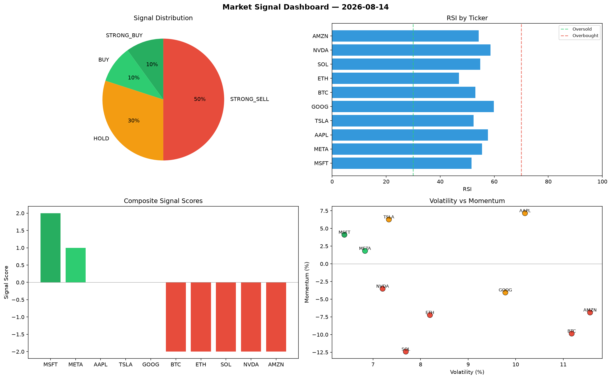

# Market Signal Report — 2026-08-14

**Run ID:** `005db059f7` | **Buy:** 2 | **Sell:** 5 | **Hold:** 3

## Signal Dashboard

| Ticker | Price | Signal | Score | RSI | Momentum | Confidence |
|--------|-------|--------|-------|-----|----------|------------|
| MSFT | $3894.67 | **STRONG_BUY** | 2 | 51.54 | 0.0411 | 0.5 |
| META | $2620.34 | **BUY** | 1 | 55.47 | 0.0183 | 0.25 |
| AAPL | $1703.22 | **HOLD** | 0 | 57.66 | 0.0716 | 0.0 |
| TSLA | $2220.03 | **HOLD** | 0 | 52.37 | 0.0627 | 0.0 |
| GOOG | $4833.66 | **HOLD** | 0 | 59.81 | -0.0405 | 0.0 |
| BTC | $3459.91 | **STRONG_SELL** | -2 | 52.97 | -0.0986 | 0.5 |
| ETH | $1036.83 | **STRONG_SELL** | -2 | 46.92 | -0.0724 | 0.5 |
| SOL | $4260.88 | **STRONG_SELL** | -2 | 54.84 | -0.1241 | 0.5 |
| NVDA | $1074.45 | **STRONG_SELL** | -2 | 58.63 | -0.0352 | 0.5 |
| AMZN | $1405.52 | **STRONG_SELL** | -2 | 54.29 | -0.0688 | 0.5 |

## Delta vs Yesterday

| Ticker | Today | Yesterday | Price Change | Signal Changed |
|--------|-------|-----------|-------------|----------------|
| MSFT | STRONG_BUY | STRONG_SELL | 📈 127.28% | ⚠️ YES |
| META | BUY | STRONG_BUY | 📉 -44.53% | ⚠️ YES |
| AAPL | HOLD | SELL | 📉 -58.41% | ⚠️ YES |
| TSLA | HOLD | SELL | 📉 -6.52% | ⚠️ YES |
| GOOG | HOLD | STRONG_SELL | 📈 31.54% | ⚠️ YES |
| BTC | STRONG_SELL | HOLD | 📉 -12.75% | ⚠️ YES |
| ETH | STRONG_SELL | HOLD | 📉 -33.0% | ⚠️ YES |
| SOL | STRONG_SELL | SELL | 📈 1210.48% | ⚠️ YES |
| NVDA | STRONG_SELL | STRONG_SELL | 📈 917.28% | — |
| AMZN | STRONG_SELL | STRONG_SELL | 📈 258.28% | — |