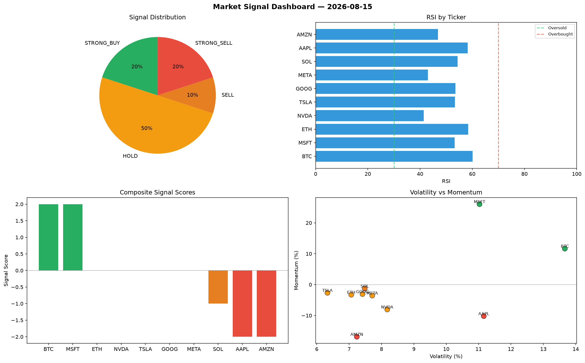

# Market Signal Report — 2026-08-15

**Run ID:** `de2ab59e58` | **Buy:** 2 | **Sell:** 3 | **Hold:** 5

## Signal Dashboard

| Ticker | Price | Signal | Score | RSI | Momentum | Confidence |
|--------|-------|--------|-------|-----|----------|------------|
| BTC | $382.87 | **STRONG_BUY** | 2 | 60.07 | 0.1165 | 0.5 |
| MSFT | $674.86 | **STRONG_BUY** | 2 | 53.29 | 0.2605 | 0.5 |
| ETH | $254.74 | **HOLD** | 0 | 58.46 | -0.0328 | 0.0 |
| NVDA | $3350.62 | **HOLD** | 0 | 41.41 | -0.0805 | 0.0 |
| TSLA | $1457.47 | **HOLD** | 0 | 53.33 | -0.0266 | 0.0 |
| GOOG | $4236.57 | **HOLD** | 0 | 53.5 | -0.0306 | 0.0 |
| META | $4381.73 | **HOLD** | 0 | 43.04 | -0.0354 | 0.0 |
| SOL | $451.51 | **SELL** | -1 | 54.36 | -0.0125 | 0.25 |
| AAPL | $1447.27 | **STRONG_SELL** | -2 | 58.21 | -0.102 | 0.5 |
| AMZN | $175.15 | **STRONG_SELL** | -2 | 46.86 | -0.1688 | 0.5 |

## Delta vs Yesterday

| Ticker | Today | Yesterday | Price Change | Signal Changed |
|--------|-------|-----------|-------------|----------------|
| BTC | STRONG_BUY | STRONG_BUY | 📉 -76.82% | — |
| MSFT | STRONG_BUY | STRONG_SELL | 📉 -56.11% | ⚠️ YES |
| ETH | HOLD | STRONG_SELL | 📉 -59.45% | ⚠️ YES |
| NVDA | HOLD | HOLD | 📈 98.68% | — |
| TSLA | HOLD | STRONG_BUY | 📉 -28.57% | ⚠️ YES |
| GOOG | HOLD | SELL | 📈 5609.66% | ⚠️ YES |
| META | HOLD | HOLD | 📈 261.52% | — |
| SOL | SELL | STRONG_BUY | 📉 -66.24% | ⚠️ YES |
| AAPL | STRONG_SELL | SELL | 📉 -64.77% | ⚠️ YES |
| AMZN | STRONG_SELL | STRONG_SELL | 📉 -78.48% | — |