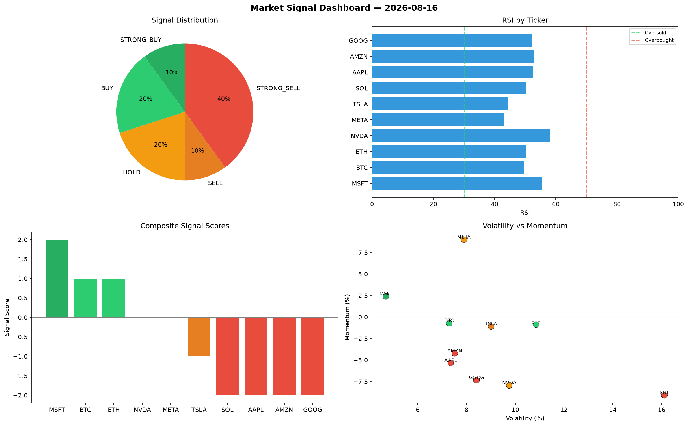

# Market Signal Report — 2026-08-16

**Run ID:** `2c04f3e552` | **Buy:** 3 | **Sell:** 5 | **Hold:** 2

## Signal Dashboard

| Ticker | Price | Signal | Score | RSI | Momentum | Confidence |
|--------|-------|--------|-------|-----|----------|------------|
| MSFT | $3584.75 | **STRONG_BUY** | 2 | 55.62 | 0.0241 | 0.5 |
| BTC | $2453.87 | **BUY** | 1 | 49.65 | -0.0072 | 0.25 |
| ETH | $4111.05 | **BUY** | 1 | 50.36 | -0.0088 | 0.25 |
| NVDA | $4044.4 | **HOLD** | 0 | 58.2 | -0.0795 | 0.0 |
| META | $4960.01 | **HOLD** | 0 | 42.9 | 0.0901 | 0.0 |
| TSLA | $2699.99 | **SELL** | -1 | 44.53 | -0.011 | 0.25 |
| SOL | $4404.93 | **STRONG_SELL** | -2 | 50.34 | -0.0909 | 0.5 |
| AAPL | $174.31 | **STRONG_SELL** | -2 | 52.49 | -0.0534 | 0.5 |
| AMZN | $3843.99 | **STRONG_SELL** | -2 | 53.06 | -0.0423 | 0.5 |
| GOOG | $159.55 | **STRONG_SELL** | -2 | 52.11 | -0.0734 | 0.5 |

## Delta vs Yesterday

| Ticker | Today | Yesterday | Price Change | Signal Changed |
|--------|-------|-----------|-------------|----------------|
| MSFT | STRONG_BUY | STRONG_SELL | 📉 -27.99% | ⚠️ YES |
| BTC | BUY | STRONG_SELL | 📈 26.85% | ⚠️ YES |
| ETH | BUY | BUY | 📈 1436.38% | — |
| NVDA | HOLD | STRONG_BUY | 📈 13.36% | ⚠️ YES |
| META | HOLD | HOLD | 📈 247.39% | — |
| TSLA | SELL | STRONG_BUY | 📈 3931.64% | ⚠️ YES |
| SOL | STRONG_SELL | STRONG_SELL | 📈 61.08% | — |
| AAPL | STRONG_SELL | SELL | 📉 -94.55% | ⚠️ YES |
| AMZN | STRONG_SELL | BUY | 📉 -1.24% | ⚠️ YES |
| GOOG | STRONG_SELL | STRONG_BUY | 📉 -96.67% | ⚠️ YES |