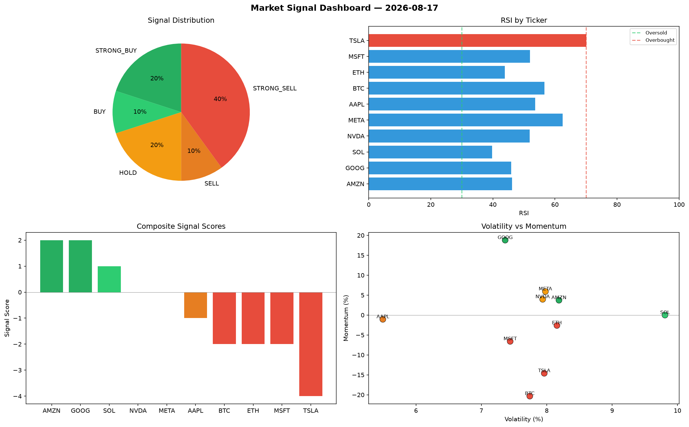

# Market Signal Report — 2026-08-17

**Run ID:** `f2bc070c97` | **Buy:** 3 | **Sell:** 5 | **Hold:** 2

## Signal Dashboard

| Ticker | Price | Signal | Score | RSI | Momentum | Confidence |
|--------|-------|--------|-------|-----|----------|------------|
| AMZN | $242.63 | **STRONG_BUY** | 2 | 46.19 | 0.0372 | 0.5 |
| GOOG | $1838.26 | **STRONG_BUY** | 2 | 45.87 | 0.1879 | 0.5 |
| SOL | $3976.46 | **BUY** | 1 | 39.72 | -0.0001 | 0.25 |
| NVDA | $3304.98 | **HOLD** | 0 | 51.87 | 0.0395 | 0.0 |
| META | $3042.66 | **HOLD** | 0 | 62.48 | 0.0591 | 0.0 |
| AAPL | $4485.74 | **SELL** | -1 | 53.66 | -0.0107 | 0.25 |
| BTC | $2859.06 | **STRONG_SELL** | -2 | 56.6 | -0.2034 | 0.5 |
| ETH | $1318.11 | **STRONG_SELL** | -2 | 43.85 | -0.0261 | 0.5 |
| MSFT | $2667.48 | **STRONG_SELL** | -2 | 51.98 | -0.066 | 0.5 |
| TSLA | $643.77 | **STRONG_SELL** | -4 | 70.12 | -0.1461 | 1.0 |

## Delta vs Yesterday

| Ticker | Today | Yesterday | Price Change | Signal Changed |
|--------|-------|-----------|-------------|----------------|
| AMZN | STRONG_BUY | STRONG_SELL | 📉 -93.69% | ⚠️ YES |
| GOOG | STRONG_BUY | STRONG_SELL | 📈 1052.15% | ⚠️ YES |
| SOL | BUY | STRONG_SELL | 📉 -9.73% | ⚠️ YES |
| NVDA | HOLD | HOLD | 📉 -18.28% | — |
| META | HOLD | HOLD | 📉 -38.66% | — |
| AAPL | SELL | STRONG_SELL | 📈 2473.43% | ⚠️ YES |
| BTC | STRONG_SELL | BUY | 📈 16.51% | ⚠️ YES |
| ETH | STRONG_SELL | BUY | 📉 -67.94% | ⚠️ YES |
| MSFT | STRONG_SELL | STRONG_BUY | 📉 -25.59% | ⚠️ YES |
| TSLA | STRONG_SELL | SELL | 📉 -76.16% | ⚠️ YES |