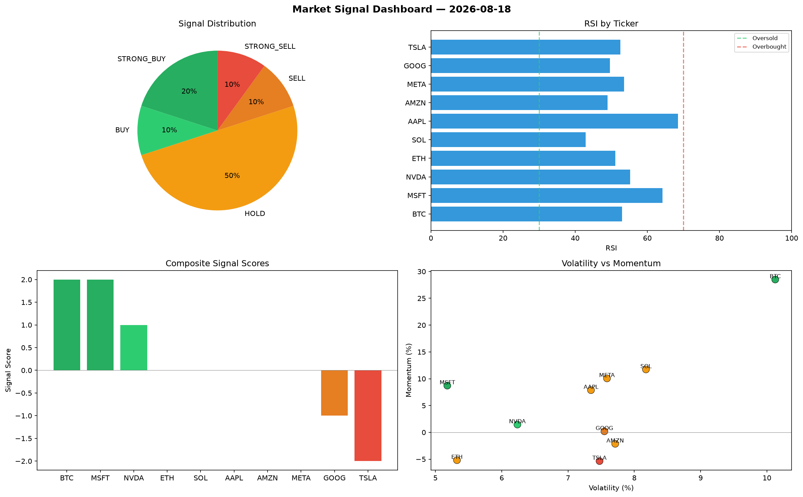

# Market Signal Report — 2026-08-18

**Run ID:** `ef335dac81` | **Buy:** 3 | **Sell:** 2 | **Hold:** 5

## Signal Dashboard

| Ticker | Price | Signal | Score | RSI | Momentum | Confidence |
|--------|-------|--------|-------|-----|----------|------------|
| BTC | $664.65 | **STRONG_BUY** | 2 | 52.96 | 0.285 | 0.5 |
| MSFT | $1945.09 | **STRONG_BUY** | 2 | 64.19 | 0.0871 | 0.5 |
| NVDA | $1254.17 | **BUY** | 1 | 55.25 | 0.0145 | 0.25 |
| ETH | $4747.62 | **HOLD** | 0 | 51.11 | -0.0519 | 0.0 |
| SOL | $2561.19 | **HOLD** | 0 | 42.89 | 0.1173 | 0.0 |
| AAPL | $781.29 | **HOLD** | 0 | 68.51 | 0.0787 | 0.0 |
| AMZN | $4006.83 | **HOLD** | 0 | 48.94 | -0.0214 | 0.0 |
| META | $1068.78 | **HOLD** | 0 | 53.59 | 0.1006 | 0.0 |
| GOOG | $2415.2 | **SELL** | -1 | 49.6 | 0.0019 | 0.25 |
| TSLA | $897.97 | **STRONG_SELL** | -2 | 52.53 | -0.0536 | 0.5 |

## Delta vs Yesterday

| Ticker | Today | Yesterday | Price Change | Signal Changed |
|--------|-------|-----------|-------------|----------------|
| BTC | STRONG_BUY | STRONG_SELL | 📉 -76.75% | ⚠️ YES |
| MSFT | STRONG_BUY | STRONG_SELL | 📉 -27.08% | ⚠️ YES |
| NVDA | BUY | HOLD | 📉 -62.05% | ⚠️ YES |
| ETH | HOLD | STRONG_SELL | 📈 260.18% | ⚠️ YES |
| SOL | HOLD | BUY | 📉 -35.59% | ⚠️ YES |
| AAPL | HOLD | SELL | 📉 -82.58% | ⚠️ YES |
| AMZN | HOLD | STRONG_BUY | 📈 1551.42% | ⚠️ YES |
| META | HOLD | HOLD | 📉 -64.87% | — |
| GOOG | SELL | STRONG_BUY | 📈 31.39% | ⚠️ YES |
| TSLA | STRONG_SELL | STRONG_SELL | 📈 39.49% | — |