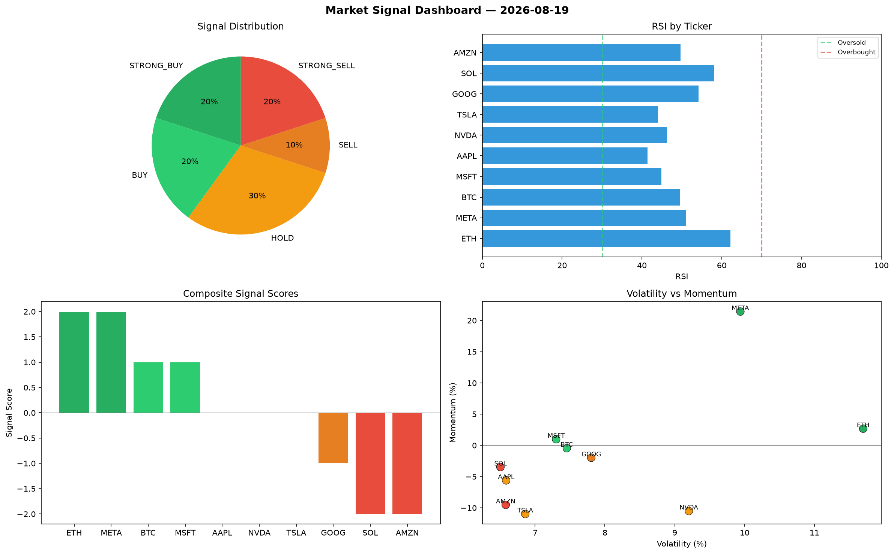

# Market Signal Report — 2026-08-19

**Run ID:** `0dbb4c041d` | **Buy:** 4 | **Sell:** 3 | **Hold:** 3

## Signal Dashboard

| Ticker | Price | Signal | Score | RSI | Momentum | Confidence |
|--------|-------|--------|-------|-----|----------|------------|
| ETH | $918.41 | **STRONG_BUY** | 2 | 62.17 | 0.0268 | 0.5 |
| META | $1268.63 | **STRONG_BUY** | 2 | 51.12 | 0.2142 | 0.5 |
| BTC | $543.88 | **BUY** | 1 | 49.48 | -0.0045 | 0.25 |
| MSFT | $3517.17 | **BUY** | 1 | 44.87 | 0.0098 | 0.25 |
| AAPL | $456.07 | **HOLD** | 0 | 41.4 | -0.056 | 0.0 |
| NVDA | $4389.31 | **HOLD** | 0 | 46.31 | -0.1051 | 0.0 |
| TSLA | $4027.02 | **HOLD** | 0 | 44.0 | -0.1098 | 0.0 |
| GOOG | $1797.52 | **SELL** | -1 | 54.18 | -0.0198 | 0.25 |
| SOL | $2884.3 | **STRONG_SELL** | -2 | 58.1 | -0.0347 | 0.5 |
| AMZN | $558.01 | **STRONG_SELL** | -2 | 49.66 | -0.0952 | 0.5 |

## Delta vs Yesterday

| Ticker | Today | Yesterday | Price Change | Signal Changed |
|--------|-------|-----------|-------------|----------------|
| ETH | STRONG_BUY | STRONG_BUY | 📈 31.72% | — |
| META | STRONG_BUY | STRONG_SELL | 📉 -27.98% | ⚠️ YES |
| BTC | BUY | HOLD | 📉 -74.12% | ⚠️ YES |
| MSFT | BUY | HOLD | 📉 -20.87% | ⚠️ YES |
| AAPL | HOLD | STRONG_SELL | 📉 -83.33% | ⚠️ YES |
| NVDA | HOLD | STRONG_SELL | 📈 60.8% | ⚠️ YES |
| TSLA | HOLD | HOLD | 📈 162.56% | — |
| GOOG | SELL | STRONG_BUY | 📈 115.22% | ⚠️ YES |
| SOL | STRONG_SELL | STRONG_SELL | 📉 -27.51% | — |
| AMZN | STRONG_SELL | HOLD | 📈 562.17% | ⚠️ YES |