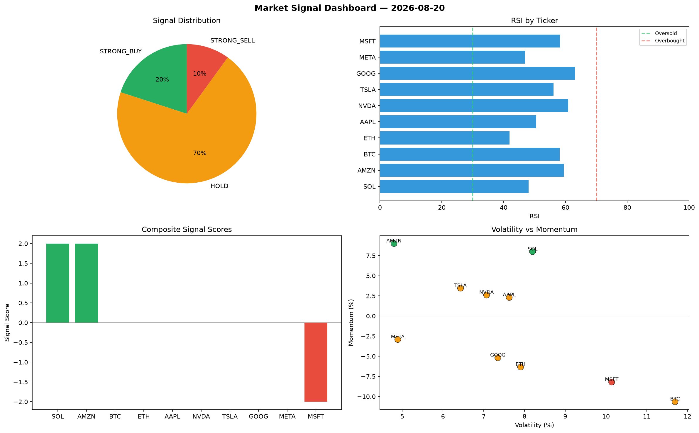

# Market Signal Report — 2026-08-20

**Run ID:** `9938f40c82` | **Buy:** 2 | **Sell:** 1 | **Hold:** 7

## Signal Dashboard

| Ticker | Price | Signal | Score | RSI | Momentum | Confidence |
|--------|-------|--------|-------|-----|----------|------------|
| SOL | $4782.73 | **STRONG_BUY** | 2 | 48.11 | 0.0799 | 0.5 |
| AMZN | $2240.2 | **STRONG_BUY** | 2 | 59.45 | 0.09 | 0.5 |
| BTC | $1195.96 | **HOLD** | 0 | 58.13 | -0.1065 | 0.0 |
| ETH | $3671.18 | **HOLD** | 0 | 41.88 | -0.0634 | 0.0 |
| AAPL | $2874.51 | **HOLD** | 0 | 50.57 | 0.023 | 0.0 |
| NVDA | $2920.77 | **HOLD** | 0 | 60.85 | 0.026 | 0.0 |
| TSLA | $2586.73 | **HOLD** | 0 | 56.12 | 0.0345 | 0.0 |
| GOOG | $2264.6 | **HOLD** | 0 | 63.05 | -0.0519 | 0.0 |
| META | $1717.8 | **HOLD** | 0 | 46.92 | -0.0292 | 0.0 |
| MSFT | $236.23 | **STRONG_SELL** | -2 | 58.24 | -0.0821 | 0.5 |

## Delta vs Yesterday

| Ticker | Today | Yesterday | Price Change | Signal Changed |
|--------|-------|-----------|-------------|----------------|
| SOL | STRONG_BUY | HOLD | 📈 85.31% | ⚠️ YES |
| AMZN | STRONG_BUY | STRONG_SELL | 📉 -43.62% | ⚠️ YES |
| BTC | HOLD | STRONG_SELL | 📉 -53.2% | ⚠️ YES |
| ETH | HOLD | HOLD | 📈 13.3% | — |
| AAPL | HOLD | HOLD | 📈 32.23% | — |
| NVDA | HOLD | STRONG_BUY | 📈 3.63% | ⚠️ YES |
| TSLA | HOLD | STRONG_SELL | 📉 -19.51% | ⚠️ YES |
| GOOG | HOLD | HOLD | 📉 -57.08% | — |
| META | HOLD | STRONG_BUY | 📈 55.7% | ⚠️ YES |
| MSFT | STRONG_SELL | SELL | 📉 -90.8% | ⚠️ YES |