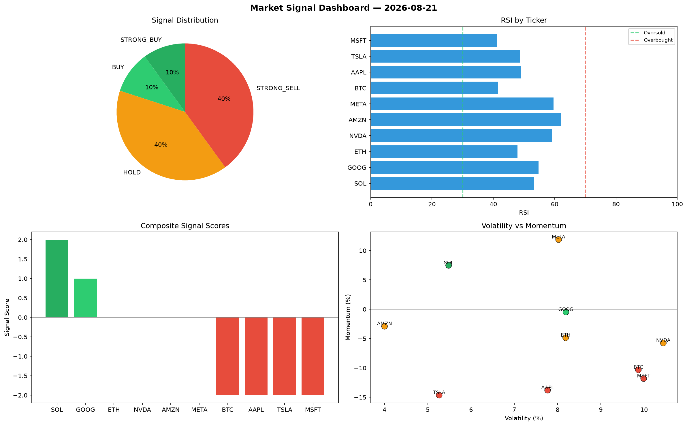

# Market Signal Report — 2026-08-21

**Run ID:** `7aaa44fca4` | **Buy:** 2 | **Sell:** 4 | **Hold:** 4

## Signal Dashboard

| Ticker | Price | Signal | Score | RSI | Momentum | Confidence |
|--------|-------|--------|-------|-----|----------|------------|
| SOL | $5126.03 | **STRONG_BUY** | 2 | 53.24 | 0.0748 | 0.5 |
| GOOG | $2682.93 | **BUY** | 1 | 54.74 | -0.0048 | 0.25 |
| ETH | $261.0 | **HOLD** | 0 | 47.92 | -0.0486 | 0.0 |
| NVDA | $4449.61 | **HOLD** | 0 | 59.15 | -0.0575 | 0.0 |
| AMZN | $3063.59 | **HOLD** | 0 | 62.13 | -0.0291 | 0.0 |
| META | $4709.99 | **HOLD** | 0 | 59.65 | 0.1187 | 0.0 |
| BTC | $1062.48 | **STRONG_SELL** | -2 | 41.47 | -0.1033 | 0.5 |
| AAPL | $4107.65 | **STRONG_SELL** | -2 | 48.95 | -0.138 | 0.5 |
| TSLA | $1353.01 | **STRONG_SELL** | -2 | 48.75 | -0.1465 | 0.5 |
| MSFT | $2299.58 | **STRONG_SELL** | -2 | 41.26 | -0.1181 | 0.5 |

## Delta vs Yesterday

| Ticker | Today | Yesterday | Price Change | Signal Changed |
|--------|-------|-----------|-------------|----------------|
| SOL | STRONG_BUY | STRONG_BUY | 📈 7.18% | — |
| GOOG | BUY | HOLD | 📈 18.47% | ⚠️ YES |
| ETH | HOLD | HOLD | 📉 -92.89% | — |
| NVDA | HOLD | HOLD | 📈 52.34% | — |
| AMZN | HOLD | STRONG_BUY | 📈 36.76% | ⚠️ YES |
| META | HOLD | HOLD | 📈 174.19% | — |
| BTC | STRONG_SELL | HOLD | 📉 -11.16% | ⚠️ YES |
| AAPL | STRONG_SELL | HOLD | 📈 42.9% | ⚠️ YES |
| TSLA | STRONG_SELL | HOLD | 📉 -47.69% | ⚠️ YES |
| MSFT | STRONG_SELL | STRONG_SELL | 📈 873.45% | — |