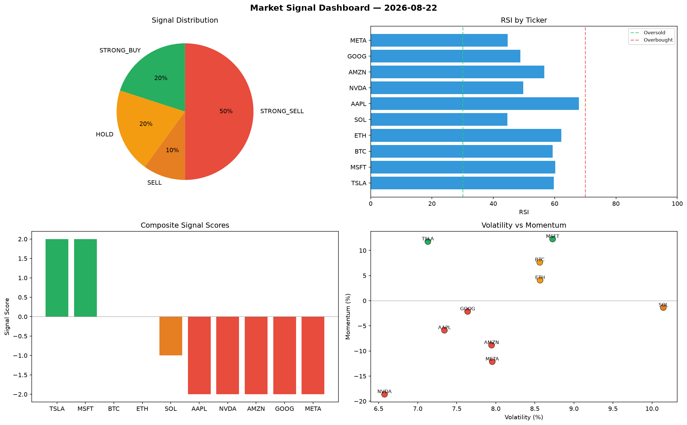

# Market Signal Report — 2026-08-22

**Run ID:** `0d50309e39` | **Buy:** 2 | **Sell:** 6 | **Hold:** 2

## Signal Dashboard

| Ticker | Price | Signal | Score | RSI | Momentum | Confidence |
|--------|-------|--------|-------|-----|----------|------------|
| TSLA | $65.26 | **STRONG_BUY** | 2 | 59.72 | 0.1177 | 0.5 |
| MSFT | $938.9 | **STRONG_BUY** | 2 | 60.23 | 0.1227 | 0.5 |
| BTC | $2962.13 | **HOLD** | 0 | 59.35 | 0.0764 | 0.0 |
| ETH | $2800.53 | **HOLD** | 0 | 62.16 | 0.0408 | 0.0 |
| SOL | $3371.0 | **SELL** | -1 | 44.6 | -0.0136 | 0.25 |
| AAPL | $4884.63 | **STRONG_SELL** | -2 | 67.95 | -0.0588 | 0.5 |
| NVDA | $3945.36 | **STRONG_SELL** | -2 | 49.79 | -0.1862 | 0.5 |
| AMZN | $672.08 | **STRONG_SELL** | -2 | 56.6 | -0.0885 | 0.5 |
| GOOG | $1043.37 | **STRONG_SELL** | -2 | 48.85 | -0.0214 | 0.5 |
| META | $1181.49 | **STRONG_SELL** | -2 | 44.71 | -0.1213 | 0.5 |

## Delta vs Yesterday

| Ticker | Today | Yesterday | Price Change | Signal Changed |
|--------|-------|-----------|-------------|----------------|
| TSLA | STRONG_BUY | STRONG_SELL | 📉 -95.18% | ⚠️ YES |
| MSFT | STRONG_BUY | STRONG_SELL | 📉 -59.17% | ⚠️ YES |
| BTC | HOLD | STRONG_SELL | 📈 178.79% | ⚠️ YES |
| ETH | HOLD | HOLD | 📈 973.0% | — |
| SOL | SELL | STRONG_BUY | 📉 -34.24% | ⚠️ YES |
| AAPL | STRONG_SELL | STRONG_SELL | 📈 18.92% | — |
| NVDA | STRONG_SELL | HOLD | 📉 -11.33% | ⚠️ YES |
| AMZN | STRONG_SELL | HOLD | 📉 -78.06% | ⚠️ YES |
| GOOG | STRONG_SELL | BUY | 📉 -61.11% | ⚠️ YES |
| META | STRONG_SELL | HOLD | 📉 -74.92% | ⚠️ YES |