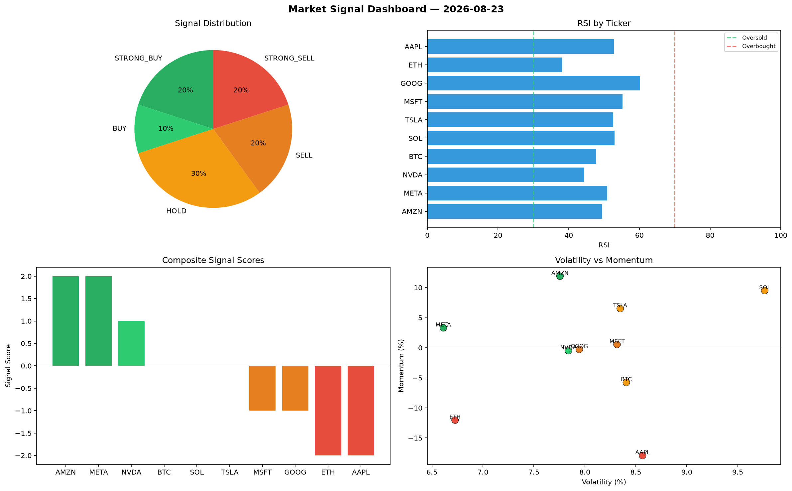

# Market Signal Report — 2026-08-23

**Run ID:** `4b7fdc33e1` | **Buy:** 3 | **Sell:** 4 | **Hold:** 3

## Signal Dashboard

| Ticker | Price | Signal | Score | RSI | Momentum | Confidence |
|--------|-------|--------|-------|-----|----------|------------|
| AMZN | $3944.32 | **STRONG_BUY** | 2 | 49.41 | 0.119 | 0.5 |
| META | $2493.26 | **STRONG_BUY** | 2 | 50.87 | 0.0331 | 0.5 |
| NVDA | $4023.13 | **BUY** | 1 | 44.28 | -0.0048 | 0.25 |
| BTC | $1327.38 | **HOLD** | 0 | 47.8 | -0.0577 | 0.0 |
| SOL | $3430.45 | **HOLD** | 0 | 52.97 | 0.095 | 0.0 |
| TSLA | $963.32 | **HOLD** | 0 | 52.59 | 0.0651 | 0.0 |
| MSFT | $1058.06 | **SELL** | -1 | 55.27 | 0.0053 | 0.25 |
| GOOG | $1052.09 | **SELL** | -1 | 60.2 | -0.0028 | 0.25 |
| ETH | $2871.64 | **STRONG_SELL** | -2 | 38.12 | -0.1203 | 0.5 |
| AAPL | $1572.22 | **STRONG_SELL** | -2 | 52.75 | -0.1792 | 0.5 |

## Delta vs Yesterday

| Ticker | Today | Yesterday | Price Change | Signal Changed |
|--------|-------|-----------|-------------|----------------|
| AMZN | STRONG_BUY | STRONG_BUY | 📈 406.34% | — |
| META | STRONG_BUY | STRONG_SELL | 📉 -26.59% | ⚠️ YES |
| NVDA | BUY | STRONG_SELL | 📈 90.6% | ⚠️ YES |
| BTC | HOLD | HOLD | 📉 -53.33% | — |
| SOL | HOLD | SELL | 📈 251.63% | ⚠️ YES |
| TSLA | HOLD | STRONG_SELL | 📉 -63.06% | ⚠️ YES |
| MSFT | SELL | STRONG_SELL | 📉 -72.55% | ⚠️ YES |
| GOOG | SELL | STRONG_BUY | 📈 58.87% | ⚠️ YES |
| ETH | STRONG_SELL | STRONG_BUY | 📈 1017.2% | ⚠️ YES |
| AAPL | STRONG_SELL | BUY | 📉 -47.56% | ⚠️ YES |