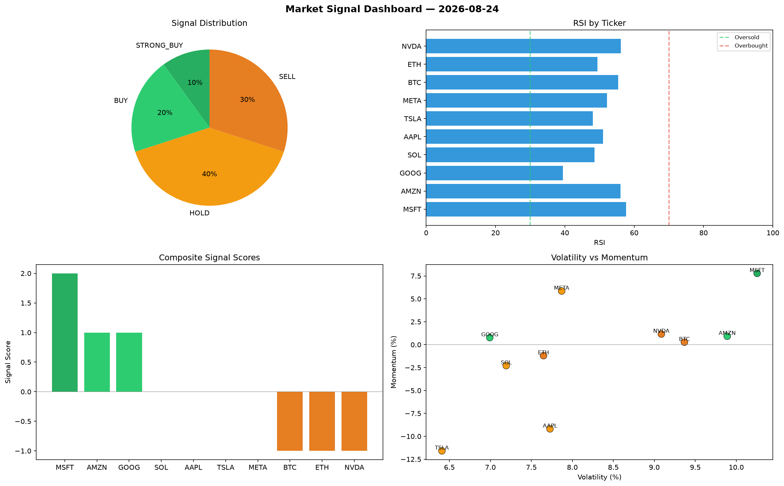

# Market Signal Report — 2026-08-24

**Run ID:** `d07cae1f8f` | **Buy:** 3 | **Sell:** 3 | **Hold:** 4

## Signal Dashboard

| Ticker | Price | Signal | Score | RSI | Momentum | Confidence |
|--------|-------|--------|-------|-----|----------|------------|
| MSFT | $2105.48 | **STRONG_BUY** | 2 | 57.68 | 0.0778 | 0.5 |
| AMZN | $269.09 | **BUY** | 1 | 56.09 | 0.0092 | 0.25 |
| GOOG | $1026.49 | **BUY** | 1 | 39.42 | 0.0077 | 0.25 |
| SOL | $3315.27 | **HOLD** | 0 | 48.59 | -0.0229 | 0.0 |
| AAPL | $1643.34 | **HOLD** | 0 | 51.03 | -0.0919 | 0.0 |
| TSLA | $4759.06 | **HOLD** | 0 | 48.09 | -0.1159 | 0.0 |
| META | $333.04 | **HOLD** | 0 | 52.11 | 0.0585 | 0.0 |
| BTC | $3240.68 | **SELL** | -1 | 55.35 | 0.0027 | 0.25 |
| ETH | $2228.43 | **SELL** | -1 | 49.38 | -0.012 | 0.25 |
| NVDA | $3610.79 | **SELL** | -1 | 56.16 | 0.0116 | 0.25 |

## Delta vs Yesterday

| Ticker | Today | Yesterday | Price Change | Signal Changed |
|--------|-------|-----------|-------------|----------------|
| MSFT | STRONG_BUY | SELL | 📈 98.99% | ⚠️ YES |
| AMZN | BUY | STRONG_BUY | 📉 -93.18% | ⚠️ YES |
| GOOG | BUY | SELL | 📉 -2.43% | ⚠️ YES |
| SOL | HOLD | HOLD | 📉 -3.36% | — |
| AAPL | HOLD | STRONG_SELL | 📈 4.52% | ⚠️ YES |
| TSLA | HOLD | HOLD | 📈 394.03% | — |
| META | HOLD | STRONG_BUY | 📉 -86.64% | ⚠️ YES |
| BTC | SELL | HOLD | 📈 144.14% | ⚠️ YES |
| ETH | SELL | STRONG_SELL | 📉 -22.4% | ⚠️ YES |
| NVDA | SELL | BUY | 📉 -10.25% | ⚠️ YES |