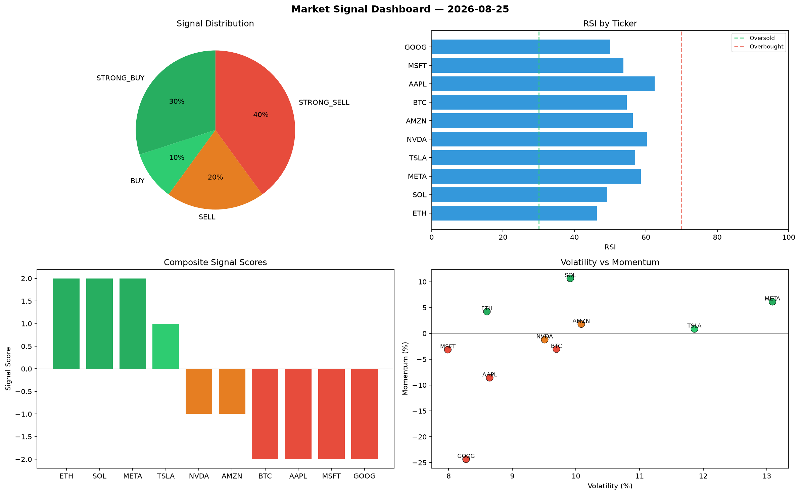

# Market Signal Report — 2026-08-25

**Run ID:** `8a8dcd36c7` | **Buy:** 4 | **Sell:** 6 | **Hold:** 0

## Signal Dashboard

| Ticker | Price | Signal | Score | RSI | Momentum | Confidence |
|--------|-------|--------|-------|-----|----------|------------|
| ETH | $4796.05 | **STRONG_BUY** | 2 | 46.29 | 0.0421 | 0.5 |
| SOL | $5147.36 | **STRONG_BUY** | 2 | 49.17 | 0.1064 | 0.5 |
| META | $4894.78 | **STRONG_BUY** | 2 | 58.61 | 0.0612 | 0.5 |
| TSLA | $4169.96 | **BUY** | 1 | 57.06 | 0.0086 | 0.25 |
| NVDA | $1023.25 | **SELL** | -1 | 60.31 | -0.0121 | 0.25 |
| AMZN | $1685.95 | **SELL** | -1 | 56.34 | 0.018 | 0.25 |
| BTC | $4805.77 | **STRONG_SELL** | -2 | 54.65 | -0.0305 | 0.5 |
| AAPL | $2105.11 | **STRONG_SELL** | -2 | 62.45 | -0.0859 | 0.5 |
| MSFT | $3585.41 | **STRONG_SELL** | -2 | 53.73 | -0.0315 | 0.5 |
| GOOG | $1780.24 | **STRONG_SELL** | -2 | 50.08 | -0.2435 | 0.5 |

## Delta vs Yesterday

| Ticker | Today | Yesterday | Price Change | Signal Changed |
|--------|-------|-----------|-------------|----------------|
| ETH | STRONG_BUY | STRONG_BUY | 📈 480.89% | — |
| SOL | STRONG_BUY | HOLD | 📈 63.13% | ⚠️ YES |
| META | STRONG_BUY | HOLD | 📈 46.21% | ⚠️ YES |
| TSLA | BUY | STRONG_SELL | 📈 11.57% | ⚠️ YES |
| NVDA | SELL | SELL | 📉 -74.23% | — |
| AMZN | SELL | HOLD | 📈 8.07% | ⚠️ YES |
| BTC | STRONG_SELL | STRONG_BUY | 📈 761.08% | ⚠️ YES |
| AAPL | STRONG_SELL | STRONG_SELL | 📉 -35.85% | — |
| MSFT | STRONG_SELL | STRONG_SELL | 📈 323.99% | — |
| GOOG | STRONG_SELL | STRONG_BUY | 📉 -40.35% | ⚠️ YES |