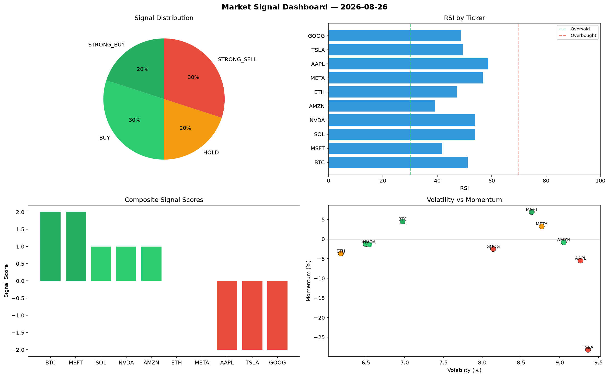

# Market Signal Report — 2026-08-26

**Run ID:** `15b4c53a8c` | **Buy:** 5 | **Sell:** 3 | **Hold:** 2

## Signal Dashboard

| Ticker | Price | Signal | Score | RSI | Momentum | Confidence |
|--------|-------|--------|-------|-----|----------|------------|
| BTC | $4991.99 | **STRONG_BUY** | 2 | 51.16 | 0.0447 | 0.5 |
| MSFT | $1897.98 | **STRONG_BUY** | 2 | 41.7 | 0.0689 | 0.5 |
| SOL | $254.52 | **BUY** | 1 | 54.04 | -0.0124 | 0.25 |
| NVDA | $380.86 | **BUY** | 1 | 53.98 | -0.0137 | 0.25 |
| AMZN | $1840.56 | **BUY** | 1 | 39.12 | -0.0082 | 0.25 |
| ETH | $2301.45 | **HOLD** | 0 | 47.34 | -0.0369 | 0.0 |
| META | $3961.2 | **HOLD** | 0 | 56.74 | 0.0323 | 0.0 |
| AAPL | $2731.05 | **STRONG_SELL** | -2 | 58.64 | -0.0549 | 0.5 |
| TSLA | $3160.46 | **STRONG_SELL** | -2 | 49.61 | -0.2821 | 0.5 |
| GOOG | $1382.76 | **STRONG_SELL** | -2 | 48.87 | -0.0252 | 0.5 |

## Delta vs Yesterday

| Ticker | Today | Yesterday | Price Change | Signal Changed |
|--------|-------|-----------|-------------|----------------|
| BTC | STRONG_BUY | SELL | 📈 4102.72% | ⚠️ YES |
| MSFT | STRONG_BUY | HOLD | 📉 -55.02% | ⚠️ YES |
| SOL | BUY | STRONG_SELL | 📉 -93.63% | ⚠️ YES |
| NVDA | BUY | STRONG_SELL | 📉 -71.08% | ⚠️ YES |
| AMZN | BUY | HOLD | 📉 -48.51% | ⚠️ YES |
| ETH | HOLD | HOLD | 📈 42.85% | — |
| META | HOLD | HOLD | 📈 277.03% | — |
| AAPL | STRONG_SELL | STRONG_BUY | 📈 372.46% | ⚠️ YES |
| TSLA | STRONG_SELL | SELL | 📉 -17.34% | ⚠️ YES |
| GOOG | STRONG_SELL | STRONG_SELL | 📈 80.92% | — |