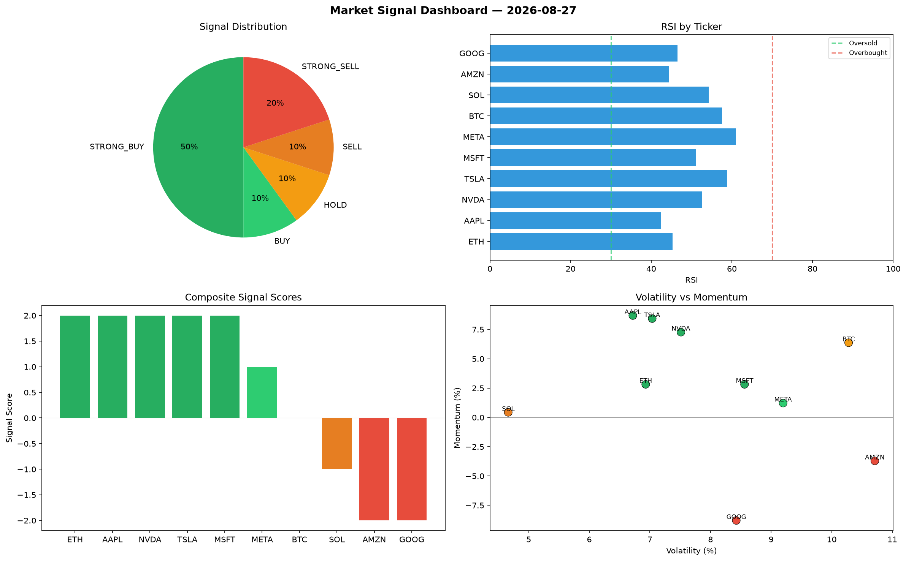

# Market Signal Report — 2026-08-27

**Run ID:** `f3222923f0` | **Buy:** 6 | **Sell:** 3 | **Hold:** 1

## Signal Dashboard

| Ticker | Price | Signal | Score | RSI | Momentum | Confidence |
|--------|-------|--------|-------|-----|----------|------------|
| ETH | $660.49 | **STRONG_BUY** | 2 | 45.34 | 0.0282 | 0.5 |
| AAPL | $2878.5 | **STRONG_BUY** | 2 | 42.5 | 0.0869 | 0.5 |
| NVDA | $1538.0 | **STRONG_BUY** | 2 | 52.63 | 0.0727 | 0.5 |
| TSLA | $5444.92 | **STRONG_BUY** | 2 | 58.81 | 0.0843 | 0.5 |
| MSFT | $2347.48 | **STRONG_BUY** | 2 | 51.1 | 0.0282 | 0.5 |
| META | $133.34 | **BUY** | 1 | 61.07 | 0.0122 | 0.25 |
| BTC | $2332.41 | **HOLD** | 0 | 57.53 | 0.0637 | 0.0 |
| SOL | $4288.21 | **SELL** | -1 | 54.25 | 0.0043 | 0.25 |
| AMZN | $79.34 | **STRONG_SELL** | -2 | 44.49 | -0.0371 | 0.5 |
| GOOG | $874.25 | **STRONG_SELL** | -2 | 46.49 | -0.0879 | 0.5 |

## Delta vs Yesterday

| Ticker | Today | Yesterday | Price Change | Signal Changed |
|--------|-------|-----------|-------------|----------------|
| ETH | STRONG_BUY | STRONG_BUY | 📉 -86.05% | — |
| AAPL | STRONG_BUY | HOLD | 📈 397.2% | ⚠️ YES |
| NVDA | STRONG_BUY | HOLD | 📉 -51.51% | ⚠️ YES |
| TSLA | STRONG_BUY | SELL | 📈 27.68% | ⚠️ YES |
| MSFT | STRONG_BUY | HOLD | 📉 -27.85% | ⚠️ YES |
| META | BUY | STRONG_SELL | 📉 -97.02% | ⚠️ YES |
| BTC | HOLD | STRONG_BUY | 📈 41.09% | ⚠️ YES |
| SOL | SELL | STRONG_BUY | 📈 120.02% | ⚠️ YES |
| AMZN | STRONG_SELL | HOLD | 📉 -97.86% | ⚠️ YES |
| GOOG | STRONG_SELL | HOLD | 📉 -45.21% | ⚠️ YES |