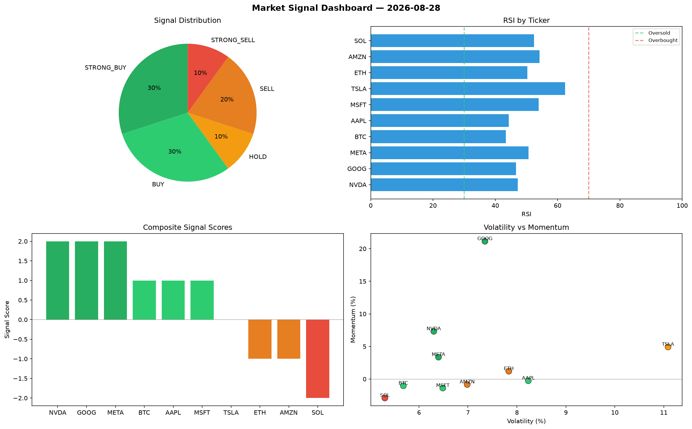

# Market Signal Report — 2026-08-28

**Run ID:** `b9b80ed897` | **Buy:** 6 | **Sell:** 3 | **Hold:** 1

## Signal Dashboard

| Ticker | Price | Signal | Score | RSI | Momentum | Confidence |
|--------|-------|--------|-------|-----|----------|------------|
| NVDA | $1046.61 | **STRONG_BUY** | 2 | 47.21 | 0.0732 | 0.5 |
| GOOG | $1775.44 | **STRONG_BUY** | 2 | 46.63 | 0.2114 | 0.5 |
| META | $3302.32 | **STRONG_BUY** | 2 | 50.62 | 0.0336 | 0.5 |
| BTC | $1131.27 | **BUY** | 1 | 43.36 | -0.0103 | 0.25 |
| AAPL | $1458.95 | **BUY** | 1 | 44.3 | -0.0026 | 0.25 |
| MSFT | $2575.13 | **BUY** | 1 | 53.92 | -0.0138 | 0.25 |
| TSLA | $3655.57 | **HOLD** | 0 | 62.44 | 0.0492 | 0.0 |
| ETH | $3879.73 | **SELL** | -1 | 50.26 | 0.012 | 0.25 |
| AMZN | $4857.0 | **SELL** | -1 | 54.25 | -0.0084 | 0.25 |
| SOL | $2661.24 | **STRONG_SELL** | -2 | 52.44 | -0.0291 | 0.5 |

## Delta vs Yesterday

| Ticker | Today | Yesterday | Price Change | Signal Changed |
|--------|-------|-----------|-------------|----------------|
| NVDA | STRONG_BUY | STRONG_BUY | 📉 -31.95% | — |
| GOOG | STRONG_BUY | STRONG_SELL | 📈 103.08% | ⚠️ YES |
| META | STRONG_BUY | BUY | 📈 2376.62% | ⚠️ YES |
| BTC | BUY | HOLD | 📉 -51.5% | ⚠️ YES |
| AAPL | BUY | STRONG_BUY | 📉 -49.32% | ⚠️ YES |
| MSFT | BUY | STRONG_BUY | 📈 9.7% | ⚠️ YES |
| TSLA | HOLD | STRONG_BUY | 📉 -32.86% | ⚠️ YES |
| ETH | SELL | STRONG_BUY | 📈 487.4% | ⚠️ YES |
| AMZN | SELL | STRONG_SELL | 📈 6021.75% | ⚠️ YES |
| SOL | STRONG_SELL | SELL | 📉 -37.94% | ⚠️ YES |