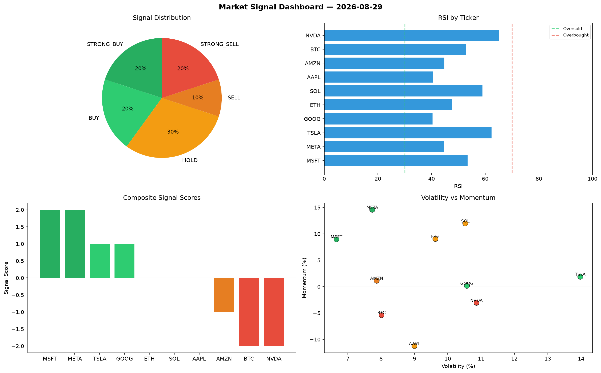

# Market Signal Report — 2026-08-29

**Run ID:** `2268d903f2` | **Buy:** 4 | **Sell:** 3 | **Hold:** 3

## Signal Dashboard

| Ticker | Price | Signal | Score | RSI | Momentum | Confidence |
|--------|-------|--------|-------|-----|----------|------------|
| MSFT | $1851.83 | **STRONG_BUY** | 2 | 53.47 | 0.0896 | 0.5 |
| META | $3069.73 | **STRONG_BUY** | 2 | 44.7 | 0.1456 | 0.5 |
| TSLA | $68.78 | **BUY** | 1 | 62.4 | 0.0187 | 0.25 |
| GOOG | $2481.7 | **BUY** | 1 | 40.37 | 0.0015 | 0.25 |
| ETH | $471.79 | **HOLD** | 0 | 47.68 | 0.0903 | 0.0 |
| SOL | $3553.85 | **HOLD** | 0 | 58.98 | 0.1197 | 0.0 |
| AAPL | $2716.12 | **HOLD** | 0 | 40.7 | -0.1126 | 0.0 |
| AMZN | $69.16 | **SELL** | -1 | 44.83 | 0.0111 | 0.25 |
| BTC | $2687.04 | **STRONG_SELL** | -2 | 52.86 | -0.054 | 0.5 |
| NVDA | $2694.57 | **STRONG_SELL** | -2 | 65.28 | -0.0307 | 0.5 |

## Delta vs Yesterday

| Ticker | Today | Yesterday | Price Change | Signal Changed |
|--------|-------|-----------|-------------|----------------|
| MSFT | STRONG_BUY | STRONG_SELL | 📉 -32.63% | ⚠️ YES |
| META | STRONG_BUY | STRONG_SELL | 📉 -31.03% | ⚠️ YES |
| TSLA | BUY | HOLD | 📉 -98.19% | ⚠️ YES |
| GOOG | BUY | STRONG_SELL | 📈 35.72% | ⚠️ YES |
| ETH | HOLD | STRONG_BUY | 📉 -90.09% | ⚠️ YES |
| SOL | HOLD | STRONG_SELL | 📉 -5.18% | ⚠️ YES |
| AAPL | HOLD | STRONG_SELL | 📉 -5.97% | ⚠️ YES |
| AMZN | SELL | STRONG_BUY | 📉 -97.43% | ⚠️ YES |
| BTC | STRONG_SELL | HOLD | 📈 7.76% | ⚠️ YES |
| NVDA | STRONG_SELL | STRONG_BUY | 📉 -8.75% | ⚠️ YES |