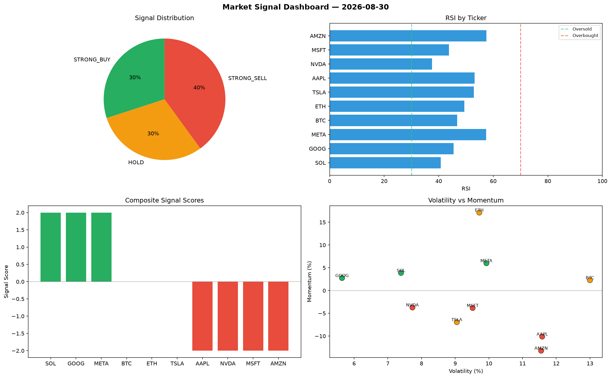

# Market Signal Report — 2026-08-30

**Run ID:** `1f6d3dbac1` | **Buy:** 3 | **Sell:** 4 | **Hold:** 3

## Signal Dashboard

| Ticker | Price | Signal | Score | RSI | Momentum | Confidence |
|--------|-------|--------|-------|-----|----------|------------|
| SOL | $4966.75 | **STRONG_BUY** | 2 | 40.74 | 0.0387 | 0.5 |
| GOOG | $4227.52 | **STRONG_BUY** | 2 | 45.42 | 0.0275 | 0.5 |
| META | $2098.0 | **STRONG_BUY** | 2 | 57.36 | 0.0601 | 0.5 |
| BTC | $5187.35 | **HOLD** | 0 | 46.8 | 0.0227 | 0.0 |
| ETH | $3374.79 | **HOLD** | 0 | 49.38 | 0.1712 | 0.0 |
| TSLA | $2660.03 | **HOLD** | 0 | 52.9 | -0.0694 | 0.0 |
| AAPL | $386.22 | **STRONG_SELL** | -2 | 53.15 | -0.1012 | 0.5 |
| NVDA | $2379.19 | **STRONG_SELL** | -2 | 37.58 | -0.0372 | 0.5 |
| MSFT | $2162.23 | **STRONG_SELL** | -2 | 43.73 | -0.0383 | 0.5 |
| AMZN | $2576.05 | **STRONG_SELL** | -2 | 57.52 | -0.1321 | 0.5 |

## Delta vs Yesterday

| Ticker | Today | Yesterday | Price Change | Signal Changed |
|--------|-------|-----------|-------------|----------------|
| SOL | STRONG_BUY | STRONG_SELL | 📈 81.73% | ⚠️ YES |
| GOOG | STRONG_BUY | STRONG_SELL | 📈 119.46% | ⚠️ YES |
| META | STRONG_BUY | SELL | 📉 -56.89% | ⚠️ YES |
| BTC | HOLD | HOLD | 📈 74.72% | — |
| ETH | HOLD | STRONG_BUY | 📉 -30.8% | ⚠️ YES |
| TSLA | HOLD | STRONG_BUY | 📈 88.5% | ⚠️ YES |
| AAPL | STRONG_SELL | BUY | 📉 -52.59% | ⚠️ YES |
| NVDA | STRONG_SELL | STRONG_SELL | 📉 -33.49% | — |
| MSFT | STRONG_SELL | STRONG_BUY | 📈 88.53% | ⚠️ YES |
| AMZN | STRONG_SELL | HOLD | 📉 -37.5% | ⚠️ YES |