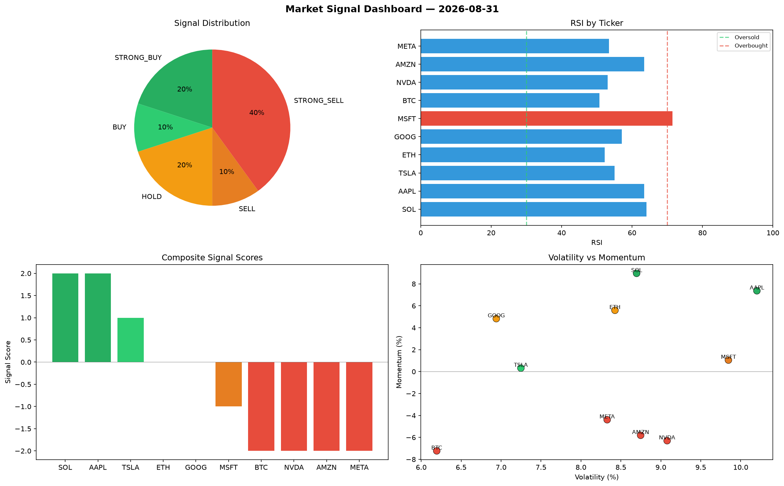

# Market Signal Report — 2026-08-31

**Run ID:** `09daf1e493` | **Buy:** 3 | **Sell:** 5 | **Hold:** 2

## Signal Dashboard

| Ticker | Price | Signal | Score | RSI | Momentum | Confidence |
|--------|-------|--------|-------|-----|----------|------------|
| SOL | $2164.23 | **STRONG_BUY** | 2 | 64.07 | 0.0896 | 0.5 |
| AAPL | $4542.52 | **STRONG_BUY** | 2 | 63.42 | 0.0737 | 0.5 |
| TSLA | $2847.34 | **BUY** | 1 | 55.07 | 0.0032 | 0.25 |
| ETH | $433.03 | **HOLD** | 0 | 52.2 | 0.0559 | 0.0 |
| GOOG | $1915.08 | **HOLD** | 0 | 57.11 | 0.0483 | 0.0 |
| MSFT | $1346.23 | **SELL** | -1 | 71.51 | 0.0105 | 0.25 |
| BTC | $861.51 | **STRONG_SELL** | -2 | 50.74 | -0.0723 | 0.5 |
| NVDA | $3326.4 | **STRONG_SELL** | -2 | 53.09 | -0.063 | 0.5 |
| AMZN | $1794.78 | **STRONG_SELL** | -2 | 63.48 | -0.0581 | 0.5 |
| META | $60.82 | **STRONG_SELL** | -2 | 53.43 | -0.0439 | 0.5 |

## Delta vs Yesterday

| Ticker | Today | Yesterday | Price Change | Signal Changed |
|--------|-------|-----------|-------------|----------------|
| SOL | STRONG_BUY | STRONG_BUY | 📉 -56.43% | — |
| AAPL | STRONG_BUY | STRONG_SELL | 📈 1076.15% | ⚠️ YES |
| TSLA | BUY | HOLD | 📈 7.04% | ⚠️ YES |
| ETH | HOLD | HOLD | 📉 -87.17% | — |
| GOOG | HOLD | STRONG_BUY | 📉 -54.7% | ⚠️ YES |
| MSFT | SELL | STRONG_SELL | 📉 -37.74% | ⚠️ YES |
| BTC | STRONG_SELL | HOLD | 📉 -83.39% | ⚠️ YES |
| NVDA | STRONG_SELL | STRONG_SELL | 📈 39.81% | — |
| AMZN | STRONG_SELL | STRONG_SELL | 📉 -30.33% | — |
| META | STRONG_SELL | STRONG_BUY | 📉 -97.1% | ⚠️ YES |