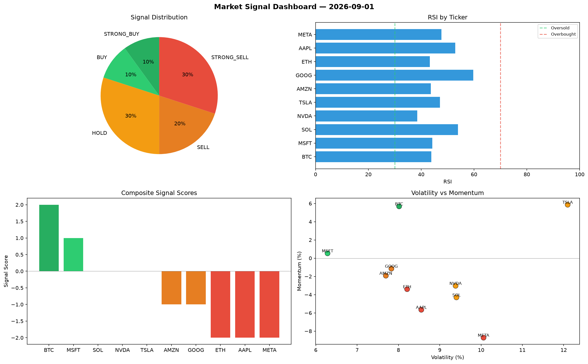

# Market Signal Report — 2026-09-01

**Run ID:** `d0aa883805` | **Buy:** 2 | **Sell:** 5 | **Hold:** 3

## Signal Dashboard

| Ticker | Price | Signal | Score | RSI | Momentum | Confidence |
|--------|-------|--------|-------|-----|----------|------------|
| BTC | $93.38 | **STRONG_BUY** | 2 | 43.85 | 0.0568 | 0.5 |
| MSFT | $3885.11 | **BUY** | 1 | 44.22 | 0.0053 | 0.25 |
| SOL | $3040.9 | **HOLD** | 0 | 53.92 | -0.043 | 0.0 |
| NVDA | $1883.29 | **HOLD** | 0 | 38.52 | -0.0303 | 0.0 |
| TSLA | $2233.19 | **HOLD** | 0 | 47.07 | 0.0586 | 0.0 |
| AMZN | $3784.62 | **SELL** | -1 | 43.69 | -0.0192 | 0.25 |
| GOOG | $2529.13 | **SELL** | -1 | 59.73 | -0.0115 | 0.25 |
| ETH | $2452.58 | **STRONG_SELL** | -2 | 43.28 | -0.034 | 0.5 |
| AAPL | $216.0 | **STRONG_SELL** | -2 | 52.94 | -0.0566 | 0.5 |
| META | $805.0 | **STRONG_SELL** | -2 | 47.68 | -0.0872 | 0.5 |

## Delta vs Yesterday

| Ticker | Today | Yesterday | Price Change | Signal Changed |
|--------|-------|-----------|-------------|----------------|
| BTC | STRONG_BUY | HOLD | 📉 -97.04% | ⚠️ YES |
| MSFT | BUY | SELL | 📈 20.52% | ⚠️ YES |
| SOL | HOLD | STRONG_BUY | 📈 160.69% | ⚠️ YES |
| NVDA | HOLD | HOLD | 📉 -58.66% | — |
| TSLA | HOLD | STRONG_SELL | 📈 3.87% | ⚠️ YES |
| AMZN | SELL | BUY | 📉 -23.37% | ⚠️ YES |
| GOOG | SELL | STRONG_SELL | 📉 -11.23% | ⚠️ YES |
| ETH | STRONG_SELL | STRONG_BUY | 📉 -44.51% | ⚠️ YES |
| AAPL | STRONG_SELL | STRONG_SELL | 📉 -92.71% | — |
| META | STRONG_SELL | STRONG_BUY | 📈 570.67% | ⚠️ YES |