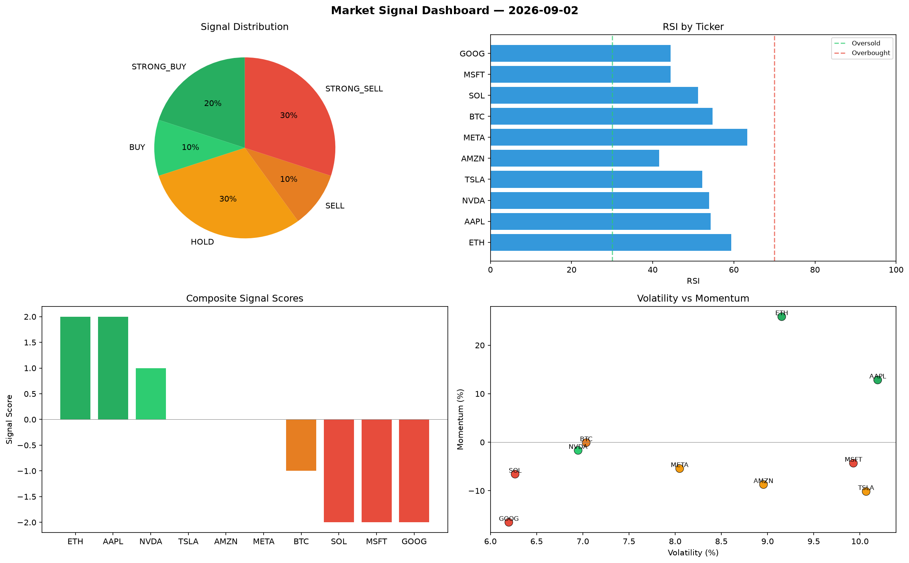

# Market Signal Report — 2026-09-02

**Run ID:** `d709d72a36` | **Buy:** 3 | **Sell:** 4 | **Hold:** 3

## Signal Dashboard

| Ticker | Price | Signal | Score | RSI | Momentum | Confidence |
|--------|-------|--------|-------|-----|----------|------------|
| ETH | $531.69 | **STRONG_BUY** | 2 | 59.36 | 0.2589 | 0.5 |
| AAPL | $1898.89 | **STRONG_BUY** | 2 | 54.31 | 0.1284 | 0.5 |
| NVDA | $4216.46 | **BUY** | 1 | 53.92 | -0.0168 | 0.25 |
| TSLA | $3634.86 | **HOLD** | 0 | 52.26 | -0.1015 | 0.0 |
| AMZN | $3885.33 | **HOLD** | 0 | 41.55 | -0.0872 | 0.0 |
| META | $1828.54 | **HOLD** | 0 | 63.29 | -0.0543 | 0.0 |
| BTC | $2970.69 | **SELL** | -1 | 54.74 | -0.0009 | 0.25 |
| SOL | $1567.19 | **STRONG_SELL** | -2 | 51.17 | -0.0658 | 0.5 |
| MSFT | $1307.48 | **STRONG_SELL** | -2 | 44.45 | -0.0432 | 0.5 |
| GOOG | $4305.57 | **STRONG_SELL** | -2 | 44.42 | -0.1651 | 0.5 |

## Delta vs Yesterday

| Ticker | Today | Yesterday | Price Change | Signal Changed |
|--------|-------|-----------|-------------|----------------|
| ETH | STRONG_BUY | STRONG_SELL | 📉 -64.71% | ⚠️ YES |
| AAPL | STRONG_BUY | HOLD | 📉 -39.11% | ⚠️ YES |
| NVDA | BUY | BUY | 📈 93.06% | — |
| TSLA | HOLD | STRONG_BUY | 📈 406.95% | ⚠️ YES |
| AMZN | HOLD | BUY | 📈 5.97% | ⚠️ YES |
| META | HOLD | STRONG_BUY | 📈 41.38% | ⚠️ YES |
| BTC | SELL | SELL | 📉 -22.4% | — |
| SOL | STRONG_SELL | STRONG_SELL | 📉 -46.23% | — |
| MSFT | STRONG_SELL | HOLD | 📉 -66.42% | ⚠️ YES |
| GOOG | STRONG_SELL | SELL | 📈 1830.75% | ⚠️ YES |