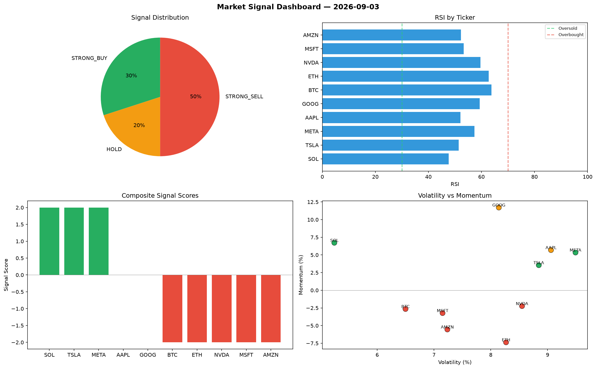

# Market Signal Report — 2026-09-03

**Run ID:** `539948ff00` | **Buy:** 3 | **Sell:** 5 | **Hold:** 2

## Signal Dashboard

| Ticker | Price | Signal | Score | RSI | Momentum | Confidence |
|--------|-------|--------|-------|-----|----------|------------|
| SOL | $1065.72 | **STRONG_BUY** | 2 | 47.64 | 0.0672 | 0.5 |
| TSLA | $1240.87 | **STRONG_BUY** | 2 | 51.41 | 0.0355 | 0.5 |
| META | $252.7 | **STRONG_BUY** | 2 | 57.36 | 0.0534 | 0.5 |
| AAPL | $1456.82 | **HOLD** | 0 | 52.12 | 0.0569 | 0.0 |
| GOOG | $1120.68 | **HOLD** | 0 | 59.32 | 0.1171 | 0.0 |
| BTC | $1814.48 | **STRONG_SELL** | -2 | 63.8 | -0.0265 | 0.5 |
| ETH | $1323.84 | **STRONG_SELL** | -2 | 62.7 | -0.0737 | 0.5 |
| NVDA | $1458.95 | **STRONG_SELL** | -2 | 59.63 | -0.0224 | 0.5 |
| MSFT | $3370.05 | **STRONG_SELL** | -2 | 53.3 | -0.0323 | 0.5 |
| AMZN | $1567.75 | **STRONG_SELL** | -2 | 52.3 | -0.0555 | 0.5 |

## Delta vs Yesterday

| Ticker | Today | Yesterday | Price Change | Signal Changed |
|--------|-------|-----------|-------------|----------------|
| SOL | STRONG_BUY | STRONG_SELL | 📈 86.4% | ⚠️ YES |
| TSLA | STRONG_BUY | HOLD | 📉 -53.61% | ⚠️ YES |
| META | STRONG_BUY | HOLD | 📉 -85.35% | ⚠️ YES |
| AAPL | HOLD | STRONG_SELL | 📉 -14.03% | ⚠️ YES |
| GOOG | HOLD | STRONG_SELL | 📉 -70.4% | ⚠️ YES |
| BTC | STRONG_SELL | STRONG_SELL | 📈 33.77% | — |
| ETH | STRONG_SELL | STRONG_SELL | 📉 -13.74% | — |
| NVDA | STRONG_SELL | STRONG_BUY | 📉 -69.59% | ⚠️ YES |
| MSFT | STRONG_SELL | STRONG_SELL | 📉 -21.25% | — |
| AMZN | STRONG_SELL | STRONG_SELL | 📉 -52.35% | — |