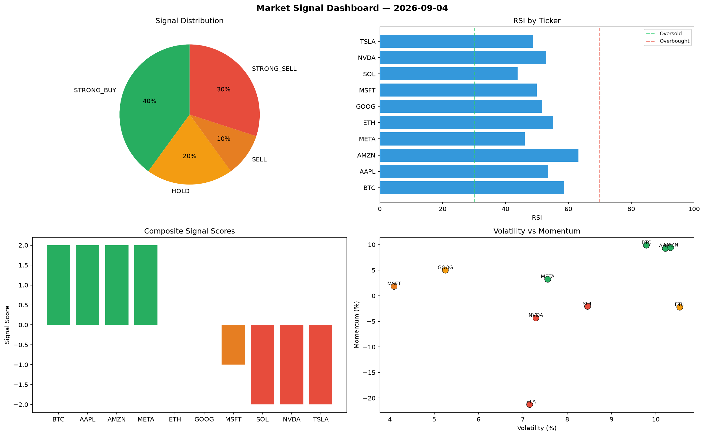

# Market Signal Report — 2026-09-04

**Run ID:** `668fb6eea3` | **Buy:** 4 | **Sell:** 4 | **Hold:** 2

## Signal Dashboard

| Ticker | Price | Signal | Score | RSI | Momentum | Confidence |
|--------|-------|--------|-------|-----|----------|------------|
| BTC | $969.01 | **STRONG_BUY** | 2 | 58.63 | 0.0988 | 0.5 |
| AAPL | $3689.91 | **STRONG_BUY** | 2 | 53.51 | 0.0925 | 0.5 |
| AMZN | $3743.56 | **STRONG_BUY** | 2 | 63.19 | 0.0941 | 0.5 |
| META | $2761.61 | **STRONG_BUY** | 2 | 46.12 | 0.0322 | 0.5 |
| ETH | $448.51 | **HOLD** | 0 | 55.13 | -0.0224 | 0.0 |
| GOOG | $2779.68 | **HOLD** | 0 | 51.62 | 0.0499 | 0.0 |
| MSFT | $4705.65 | **SELL** | -1 | 49.92 | 0.0183 | 0.25 |
| SOL | $4113.88 | **STRONG_SELL** | -2 | 43.82 | -0.0208 | 0.5 |
| NVDA | $1034.68 | **STRONG_SELL** | -2 | 52.87 | -0.0435 | 0.5 |
| TSLA | $3181.27 | **STRONG_SELL** | -2 | 48.63 | -0.2126 | 0.5 |

## Delta vs Yesterday

| Ticker | Today | Yesterday | Price Change | Signal Changed |
|--------|-------|-----------|-------------|----------------|
| BTC | STRONG_BUY | STRONG_BUY | 📉 -77.24% | — |
| AAPL | STRONG_BUY | STRONG_SELL | 📈 41.04% | ⚠️ YES |
| AMZN | STRONG_BUY | HOLD | 📈 4550.96% | ⚠️ YES |
| META | STRONG_BUY | STRONG_SELL | 📈 245.11% | ⚠️ YES |
| ETH | HOLD | HOLD | 📉 -68.66% | — |
| GOOG | HOLD | STRONG_SELL | 📉 -22.85% | ⚠️ YES |
| MSFT | SELL | STRONG_BUY | 📈 1355.96% | ⚠️ YES |
| SOL | STRONG_SELL | STRONG_BUY | 📈 47.09% | ⚠️ YES |
| NVDA | STRONG_SELL | STRONG_SELL | 📉 -7.02% | — |
| TSLA | STRONG_SELL | HOLD | 📈 51.64% | ⚠️ YES |