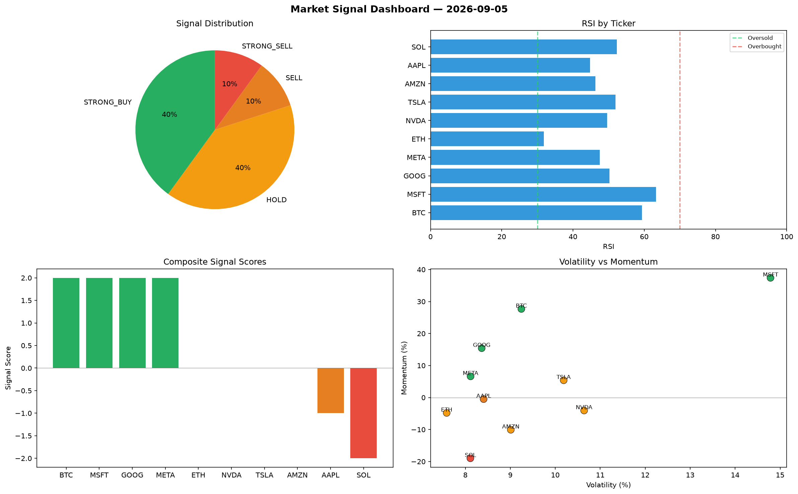

# Market Signal Report — 2026-09-05

**Run ID:** `51f362d04c` | **Buy:** 4 | **Sell:** 2 | **Hold:** 4

## Signal Dashboard

| Ticker | Price | Signal | Score | RSI | Momentum | Confidence |
|--------|-------|--------|-------|-----|----------|------------|
| BTC | $4737.77 | **STRONG_BUY** | 2 | 59.37 | 0.2768 | 0.5 |
| MSFT | $2245.67 | **STRONG_BUY** | 2 | 63.35 | 0.374 | 0.5 |
| GOOG | $2282.18 | **STRONG_BUY** | 2 | 50.28 | 0.1542 | 0.5 |
| META | $688.08 | **STRONG_BUY** | 2 | 47.5 | 0.0661 | 0.5 |
| ETH | $814.19 | **HOLD** | 0 | 31.84 | -0.0481 | 0.0 |
| NVDA | $4035.9 | **HOLD** | 0 | 49.57 | -0.0406 | 0.0 |
| TSLA | $382.22 | **HOLD** | 0 | 51.96 | 0.0539 | 0.0 |
| AMZN | $4227.55 | **HOLD** | 0 | 46.32 | -0.1008 | 0.0 |
| AAPL | $571.69 | **SELL** | -1 | 44.79 | -0.0049 | 0.25 |
| SOL | $3245.58 | **STRONG_SELL** | -2 | 52.32 | -0.1899 | 0.5 |

## Delta vs Yesterday

| Ticker | Today | Yesterday | Price Change | Signal Changed |
|--------|-------|-----------|-------------|----------------|
| BTC | STRONG_BUY | STRONG_BUY | 📈 733.67% | — |
| MSFT | STRONG_BUY | HOLD | 📈 174.74% | ⚠️ YES |
| GOOG | STRONG_BUY | HOLD | 📈 466.75% | ⚠️ YES |
| META | STRONG_BUY | BUY | 📈 28.92% | ⚠️ YES |
| ETH | HOLD | STRONG_BUY | 📈 873.1% | ⚠️ YES |
| NVDA | HOLD | STRONG_BUY | 📈 18.15% | ⚠️ YES |
| TSLA | HOLD | STRONG_SELL | 📉 -86.9% | ⚠️ YES |
| AMZN | HOLD | STRONG_SELL | 📈 39.15% | ⚠️ YES |
| AAPL | SELL | STRONG_BUY | 📉 -39.61% | ⚠️ YES |
| SOL | STRONG_SELL | BUY | 📉 -16.53% | ⚠️ YES |