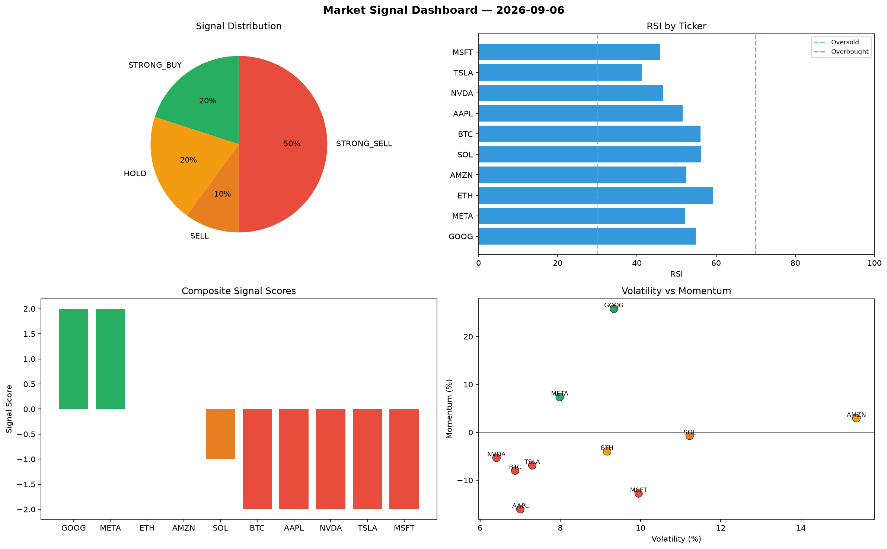

# Market Signal Report — 2026-09-06

**Run ID:** `e25a276057` | **Buy:** 2 | **Sell:** 6 | **Hold:** 2

## Signal Dashboard

| Ticker | Price | Signal | Score | RSI | Momentum | Confidence |
|--------|-------|--------|-------|-----|----------|------------|
| GOOG | $3033.33 | **STRONG_BUY** | 2 | 54.82 | 0.2579 | 0.5 |
| META | $3473.37 | **STRONG_BUY** | 2 | 52.2 | 0.0736 | 0.5 |
| ETH | $2793.55 | **HOLD** | 0 | 59.18 | -0.0398 | 0.0 |
| AMZN | $3074.53 | **HOLD** | 0 | 52.54 | 0.0293 | 0.0 |
| SOL | $4617.28 | **SELL** | -1 | 56.23 | -0.0073 | 0.25 |
| BTC | $897.99 | **STRONG_SELL** | -2 | 56.06 | -0.0799 | 0.5 |
| AAPL | $3615.3 | **STRONG_SELL** | -2 | 51.59 | -0.1607 | 0.5 |
| NVDA | $2999.8 | **STRONG_SELL** | -2 | 46.58 | -0.0533 | 0.5 |
| TSLA | $3363.84 | **STRONG_SELL** | -2 | 41.26 | -0.0691 | 0.5 |
| MSFT | $2317.29 | **STRONG_SELL** | -2 | 45.94 | -0.1277 | 0.5 |

## Delta vs Yesterday

| Ticker | Today | Yesterday | Price Change | Signal Changed |
|--------|-------|-----------|-------------|----------------|
| GOOG | STRONG_BUY | STRONG_BUY | 📉 -36.81% | — |
| META | STRONG_BUY | STRONG_BUY | 📈 220.46% | — |
| ETH | HOLD | SELL | 📈 81.41% | ⚠️ YES |
| AMZN | HOLD | STRONG_SELL | 📉 -33.38% | ⚠️ YES |
| SOL | SELL | BUY | 📈 3.84% | ⚠️ YES |
| BTC | STRONG_SELL | SELL | 📈 14.97% | ⚠️ YES |
| AAPL | STRONG_SELL | BUY | 📉 -28.2% | ⚠️ YES |
| NVDA | STRONG_SELL | STRONG_SELL | 📈 38.43% | — |
| TSLA | STRONG_SELL | STRONG_BUY | 📉 -21.73% | ⚠️ YES |
| MSFT | STRONG_SELL | SELL | 📉 -50.41% | ⚠️ YES |