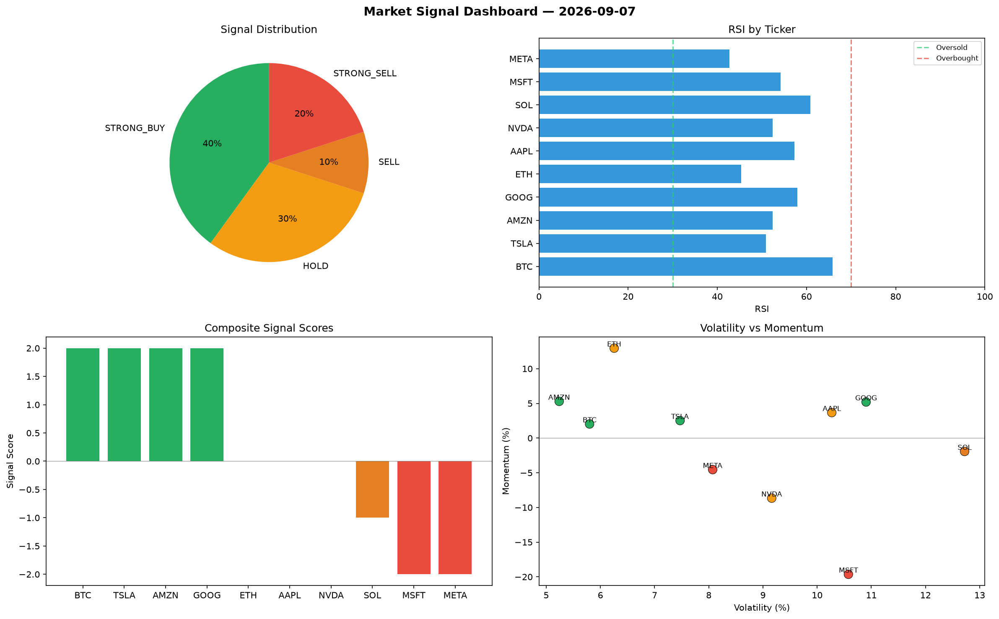

# Market Signal Report — 2026-09-07

**Run ID:** `76d2f771c7` | **Buy:** 4 | **Sell:** 3 | **Hold:** 3

## Signal Dashboard

| Ticker | Price | Signal | Score | RSI | Momentum | Confidence |
|--------|-------|--------|-------|-----|----------|------------|
| BTC | $3057.52 | **STRONG_BUY** | 2 | 65.85 | 0.0203 | 0.5 |
| TSLA | $4476.32 | **STRONG_BUY** | 2 | 50.94 | 0.0252 | 0.5 |
| AMZN | $4200.95 | **STRONG_BUY** | 2 | 52.36 | 0.0529 | 0.5 |
| GOOG | $3782.5 | **STRONG_BUY** | 2 | 57.97 | 0.052 | 0.5 |
| ETH | $5118.06 | **HOLD** | 0 | 45.36 | 0.1296 | 0.0 |
| AAPL | $4153.27 | **HOLD** | 0 | 57.29 | 0.0367 | 0.0 |
| NVDA | $2913.42 | **HOLD** | 0 | 52.39 | -0.0866 | 0.0 |
| SOL | $1111.79 | **SELL** | -1 | 60.84 | -0.0193 | 0.25 |
| MSFT | $2334.07 | **STRONG_SELL** | -2 | 54.15 | -0.1963 | 0.5 |
| META | $5045.54 | **STRONG_SELL** | -2 | 42.68 | -0.0455 | 0.5 |

## Delta vs Yesterday

| Ticker | Today | Yesterday | Price Change | Signal Changed |
|--------|-------|-----------|-------------|----------------|
| BTC | STRONG_BUY | HOLD | 📈 240.94% | ⚠️ YES |
| TSLA | STRONG_BUY | STRONG_BUY | 📈 126.44% | — |
| AMZN | STRONG_BUY | HOLD | 📈 90.83% | ⚠️ YES |
| GOOG | STRONG_BUY | SELL | 📈 1708.77% | ⚠️ YES |
| ETH | HOLD | STRONG_SELL | 📈 981.22% | ⚠️ YES |
| AAPL | HOLD | BUY | 📈 126.62% | ⚠️ YES |
| NVDA | HOLD | BUY | 📉 -36.85% | ⚠️ YES |
| SOL | SELL | HOLD | 📈 76.59% | ⚠️ YES |
| MSFT | STRONG_SELL | BUY | 📈 60.86% | ⚠️ YES |
| META | STRONG_SELL | STRONG_BUY | 📉 -9.18% | ⚠️ YES |