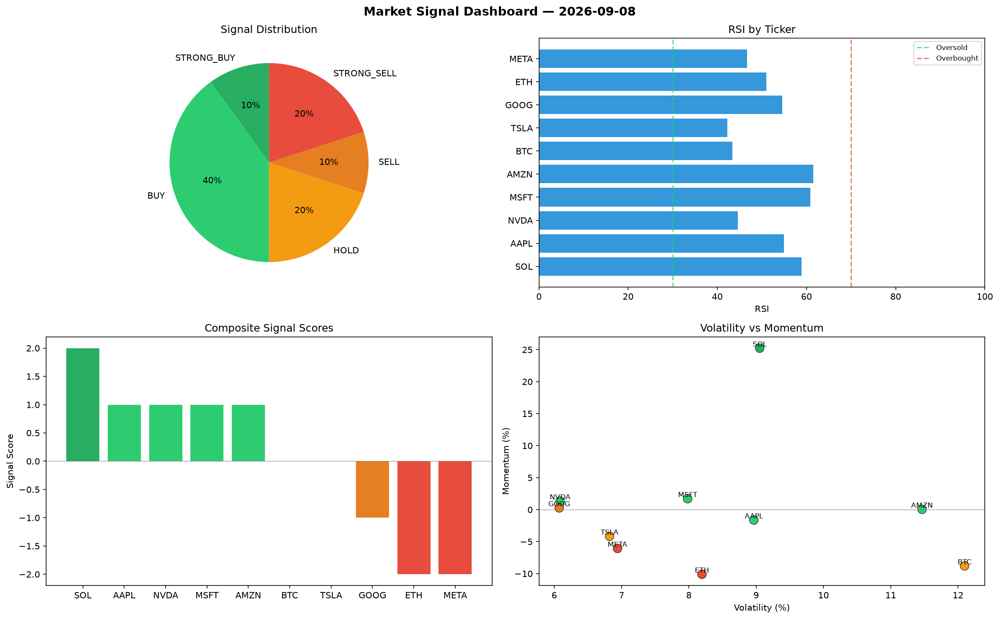

# Market Signal Report — 2026-09-08

**Run ID:** `b35297cef9` | **Buy:** 5 | **Sell:** 3 | **Hold:** 2

## Signal Dashboard

| Ticker | Price | Signal | Score | RSI | Momentum | Confidence |
|--------|-------|--------|-------|-----|----------|------------|
| SOL | $4280.45 | **STRONG_BUY** | 2 | 58.9 | 0.2524 | 0.5 |
| AAPL | $632.35 | **BUY** | 1 | 54.98 | -0.0163 | 0.25 |
| NVDA | $1574.2 | **BUY** | 1 | 44.6 | 0.0134 | 0.25 |
| MSFT | $3258.56 | **BUY** | 1 | 60.87 | 0.0171 | 0.25 |
| AMZN | $3779.85 | **BUY** | 1 | 61.56 | 0.0005 | 0.25 |
| BTC | $3573.49 | **HOLD** | 0 | 43.4 | -0.088 | 0.0 |
| TSLA | $3533.04 | **HOLD** | 0 | 42.22 | -0.0416 | 0.0 |
| GOOG | $4297.4 | **SELL** | -1 | 54.57 | 0.0027 | 0.25 |
| ETH | $3054.78 | **STRONG_SELL** | -2 | 50.99 | -0.101 | 0.5 |
| META | $235.55 | **STRONG_SELL** | -2 | 46.63 | -0.0606 | 0.5 |

## Delta vs Yesterday

| Ticker | Today | Yesterday | Price Change | Signal Changed |
|--------|-------|-----------|-------------|----------------|
| SOL | STRONG_BUY | SELL | 📈 285.01% | ⚠️ YES |
| AAPL | BUY | HOLD | 📉 -84.77% | ⚠️ YES |
| NVDA | BUY | HOLD | 📉 -45.97% | ⚠️ YES |
| MSFT | BUY | STRONG_SELL | 📈 39.61% | ⚠️ YES |
| AMZN | BUY | STRONG_BUY | 📉 -10.02% | ⚠️ YES |
| BTC | HOLD | STRONG_BUY | 📈 16.88% | ⚠️ YES |
| TSLA | HOLD | STRONG_BUY | 📉 -21.07% | ⚠️ YES |
| GOOG | SELL | STRONG_BUY | 📈 13.61% | ⚠️ YES |
| ETH | STRONG_SELL | HOLD | 📉 -40.31% | ⚠️ YES |
| META | STRONG_SELL | STRONG_SELL | 📉 -95.33% | — |