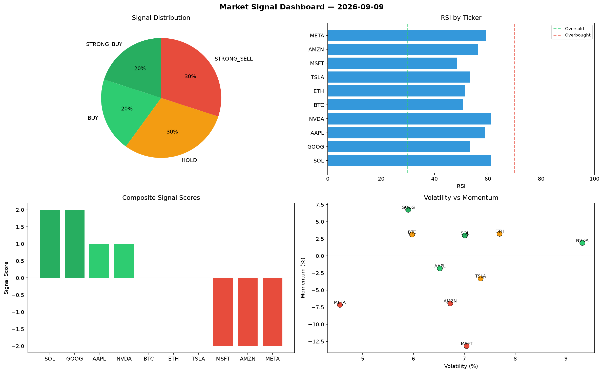

# Market Signal Report — 2026-09-09

**Run ID:** `3fcaae08fd` | **Buy:** 4 | **Sell:** 3 | **Hold:** 3

## Signal Dashboard

| Ticker | Price | Signal | Score | RSI | Momentum | Confidence |
|--------|-------|--------|-------|-----|----------|------------|
| SOL | $378.6 | **STRONG_BUY** | 2 | 61.31 | 0.0298 | 0.5 |
| GOOG | $3981.3 | **STRONG_BUY** | 2 | 53.25 | 0.0674 | 0.5 |
| AAPL | $557.18 | **BUY** | 1 | 59.02 | -0.0183 | 0.25 |
| NVDA | $1963.98 | **BUY** | 1 | 61.21 | 0.019 | 0.25 |
| BTC | $322.94 | **HOLD** | 0 | 50.84 | 0.0312 | 0.0 |
| ETH | $3438.46 | **HOLD** | 0 | 51.49 | 0.0323 | 0.0 |
| TSLA | $3425.51 | **HOLD** | 0 | 53.39 | -0.0331 | 0.0 |
| MSFT | $4008.98 | **STRONG_SELL** | -2 | 48.5 | -0.1318 | 0.5 |
| AMZN | $3995.2 | **STRONG_SELL** | -2 | 56.45 | -0.0695 | 0.5 |
| META | $4476.87 | **STRONG_SELL** | -2 | 59.41 | -0.0715 | 0.5 |

## Delta vs Yesterday

| Ticker | Today | Yesterday | Price Change | Signal Changed |
|--------|-------|-----------|-------------|----------------|
| SOL | STRONG_BUY | STRONG_SELL | 📉 -85.14% | ⚠️ YES |
| GOOG | STRONG_BUY | STRONG_BUY | 📈 1532.15% | — |
| AAPL | BUY | STRONG_SELL | 📈 53.7% | ⚠️ YES |
| NVDA | BUY | BUY | 📈 159.19% | — |
| BTC | HOLD | HOLD | 📉 -86.43% | — |
| ETH | HOLD | STRONG_SELL | 📈 59.78% | ⚠️ YES |
| TSLA | HOLD | SELL | 📈 93.55% | ⚠️ YES |
| MSFT | STRONG_SELL | HOLD | 📈 957.05% | ⚠️ YES |
| AMZN | STRONG_SELL | STRONG_BUY | 📈 1642.19% | ⚠️ YES |
| META | STRONG_SELL | BUY | 📈 18.94% | ⚠️ YES |