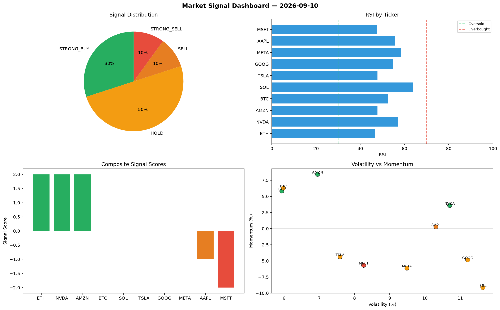

# Market Signal Report — 2026-09-10

**Run ID:** `8382eb11c7` | **Buy:** 3 | **Sell:** 2 | **Hold:** 5

## Signal Dashboard

| Ticker | Price | Signal | Score | RSI | Momentum | Confidence |
|--------|-------|--------|-------|-----|----------|------------|
| ETH | $4629.32 | **STRONG_BUY** | 2 | 46.73 | 0.0582 | 0.5 |
| NVDA | $3061.05 | **STRONG_BUY** | 2 | 56.89 | 0.0359 | 0.5 |
| AMZN | $3220.7 | **STRONG_BUY** | 2 | 47.77 | 0.0841 | 0.5 |
| BTC | $132.13 | **HOLD** | 0 | 52.66 | 0.0626 | 0.0 |
| SOL | $4805.58 | **HOLD** | 0 | 63.93 | -0.0914 | 0.0 |
| TSLA | $3663.33 | **HOLD** | 0 | 47.81 | -0.0438 | 0.0 |
| GOOG | $2906.83 | **HOLD** | 0 | 54.84 | -0.0485 | 0.0 |
| META | $3967.31 | **HOLD** | 0 | 58.54 | -0.0613 | 0.0 |
| AAPL | $3786.33 | **SELL** | -1 | 55.74 | 0.0027 | 0.25 |
| MSFT | $2482.93 | **STRONG_SELL** | -2 | 47.58 | -0.0569 | 0.5 |

## Delta vs Yesterday

| Ticker | Today | Yesterday | Price Change | Signal Changed |
|--------|-------|-----------|-------------|----------------|
| ETH | STRONG_BUY | STRONG_BUY | 📈 30.23% | — |
| NVDA | STRONG_BUY | HOLD | 📈 216.97% | ⚠️ YES |
| AMZN | STRONG_BUY | HOLD | 📈 96.07% | ⚠️ YES |
| BTC | HOLD | STRONG_BUY | 📉 -89.54% | ⚠️ YES |
| SOL | HOLD | HOLD | 📈 11.46% | — |
| TSLA | HOLD | HOLD | 📈 873.77% | — |
| GOOG | HOLD | STRONG_BUY | 📈 43.31% | ⚠️ YES |
| META | HOLD | STRONG_SELL | 📈 312.4% | ⚠️ YES |
| AAPL | SELL | HOLD | 📈 342.77% | ⚠️ YES |
| MSFT | STRONG_SELL | STRONG_BUY | 📈 25.9% | ⚠️ YES |