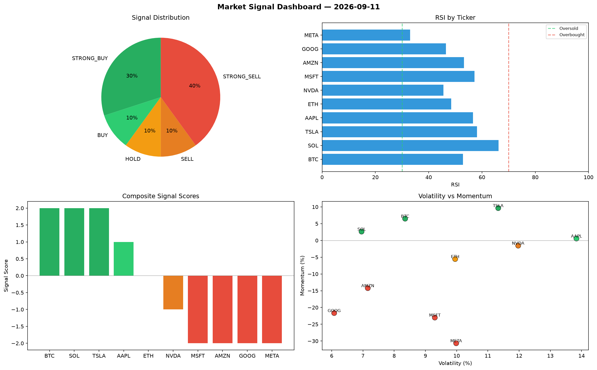

# Market Signal Report — 2026-09-11

**Run ID:** `5dded2dc6e` | **Buy:** 4 | **Sell:** 5 | **Hold:** 1

## Signal Dashboard

| Ticker | Price | Signal | Score | RSI | Momentum | Confidence |
|--------|-------|--------|-------|-----|----------|------------|
| BTC | $3498.58 | **STRONG_BUY** | 2 | 52.88 | 0.0649 | 0.5 |
| SOL | $4419.64 | **STRONG_BUY** | 2 | 66.24 | 0.0263 | 0.5 |
| TSLA | $2265.6 | **STRONG_BUY** | 2 | 58.18 | 0.0964 | 0.5 |
| AAPL | $3335.11 | **BUY** | 1 | 56.65 | 0.0056 | 0.25 |
| ETH | $1529.84 | **HOLD** | 0 | 48.46 | -0.0555 | 0.0 |
| NVDA | $834.32 | **SELL** | -1 | 45.56 | -0.0156 | 0.25 |
| MSFT | $867.39 | **STRONG_SELL** | -2 | 57.16 | -0.2301 | 0.5 |
| AMZN | $3775.61 | **STRONG_SELL** | -2 | 53.25 | -0.1423 | 0.5 |
| GOOG | $862.95 | **STRONG_SELL** | -2 | 46.52 | -0.2166 | 0.5 |
| META | $365.18 | **STRONG_SELL** | -2 | 33.01 | -0.3067 | 0.5 |

## Delta vs Yesterday

| Ticker | Today | Yesterday | Price Change | Signal Changed |
|--------|-------|-----------|-------------|----------------|
| BTC | STRONG_BUY | SELL | 📉 -20.92% | ⚠️ YES |
| SOL | STRONG_BUY | STRONG_SELL | 📈 575.0% | ⚠️ YES |
| TSLA | STRONG_BUY | STRONG_SELL | 📉 -18.43% | ⚠️ YES |
| AAPL | BUY | HOLD | 📈 28.97% | ⚠️ YES |
| ETH | HOLD | SELL | 📉 -22.55% | ⚠️ YES |
| NVDA | SELL | STRONG_SELL | 📉 -72.8% | ⚠️ YES |
| MSFT | STRONG_SELL | STRONG_SELL | 📉 -18.02% | — |
| AMZN | STRONG_SELL | BUY | 📈 25.99% | ⚠️ YES |
| GOOG | STRONG_SELL | HOLD | 📉 -61.2% | ⚠️ YES |
| META | STRONG_SELL | SELL | 📉 -85.21% | ⚠️ YES |