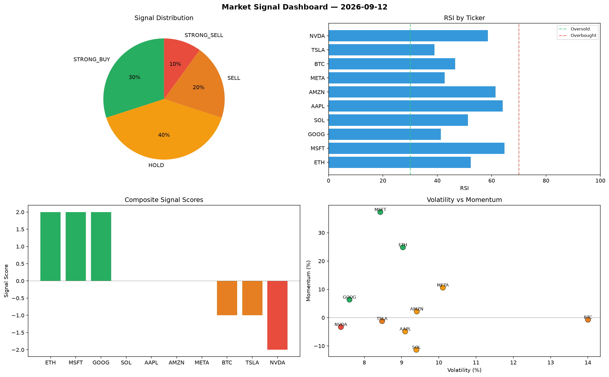

# Market Signal Report — 2026-09-12

**Run ID:** `1a71a3752f` | **Buy:** 3 | **Sell:** 3 | **Hold:** 4

## Signal Dashboard

| Ticker | Price | Signal | Score | RSI | Momentum | Confidence |
|--------|-------|--------|-------|-----|----------|------------|
| ETH | $2200.98 | **STRONG_BUY** | 2 | 52.29 | 0.2486 | 0.5 |
| MSFT | $245.22 | **STRONG_BUY** | 2 | 64.75 | 0.3732 | 0.5 |
| GOOG | $2013.84 | **STRONG_BUY** | 2 | 41.34 | 0.0637 | 0.5 |
| SOL | $2673.4 | **HOLD** | 0 | 51.25 | -0.1135 | 0.0 |
| AAPL | $4180.11 | **HOLD** | 0 | 64.03 | -0.0488 | 0.0 |
| AMZN | $3206.53 | **HOLD** | 0 | 61.47 | 0.0219 | 0.0 |
| META | $4414.53 | **HOLD** | 0 | 42.76 | 0.1062 | 0.0 |
| BTC | $3480.74 | **SELL** | -1 | 46.57 | -0.0073 | 0.25 |
| TSLA | $2113.34 | **SELL** | -1 | 38.98 | -0.0122 | 0.25 |
| NVDA | $4356.45 | **STRONG_SELL** | -2 | 58.61 | -0.033 | 0.5 |

## Delta vs Yesterday

| Ticker | Today | Yesterday | Price Change | Signal Changed |
|--------|-------|-----------|-------------|----------------|
| ETH | STRONG_BUY | BUY | 📈 18.31% | ⚠️ YES |
| MSFT | STRONG_BUY | HOLD | 📉 -88.97% | ⚠️ YES |
| GOOG | STRONG_BUY | STRONG_BUY | 📈 1454.61% | — |
| SOL | HOLD | BUY | 📈 1204.16% | ⚠️ YES |
| AAPL | HOLD | STRONG_SELL | 📉 -13.85% | ⚠️ YES |
| AMZN | HOLD | HOLD | 📈 101.74% | — |
| META | HOLD | STRONG_SELL | 📈 11.66% | ⚠️ YES |
| BTC | SELL | STRONG_BUY | 📈 176.27% | ⚠️ YES |
| TSLA | SELL | STRONG_SELL | 📉 -11.25% | ⚠️ YES |
| NVDA | STRONG_SELL | STRONG_SELL | 📈 70.5% | — |