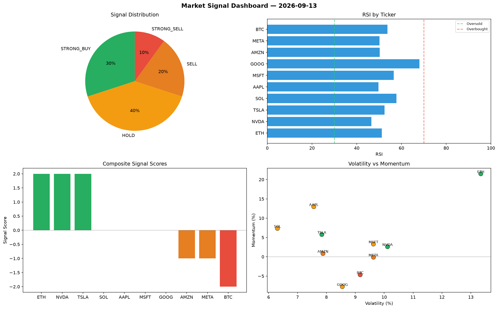

# Market Signal Report — 2026-09-13

**Run ID:** `a8b0b88b5e` | **Buy:** 3 | **Sell:** 3 | **Hold:** 4

## Signal Dashboard

| Ticker | Price | Signal | Score | RSI | Momentum | Confidence |
|--------|-------|--------|-------|-----|----------|------------|
| ETH | $2734.72 | **STRONG_BUY** | 2 | 51.19 | 0.2149 | 0.5 |
| NVDA | $2861.73 | **STRONG_BUY** | 2 | 46.5 | 0.026 | 0.5 |
| TSLA | $2502.49 | **STRONG_BUY** | 2 | 52.43 | 0.0576 | 0.5 |
| SOL | $392.57 | **HOLD** | 0 | 57.77 | 0.0734 | 0.0 |
| AAPL | $1122.6 | **HOLD** | 0 | 49.74 | 0.1296 | 0.0 |
| MSFT | $2173.63 | **HOLD** | 0 | 56.5 | 0.0329 | 0.0 |
| GOOG | $1979.81 | **HOLD** | 0 | 68.01 | -0.0774 | 0.0 |
| AMZN | $4754.48 | **SELL** | -1 | 50.25 | 0.0084 | 0.25 |
| META | $859.61 | **SELL** | -1 | 50.15 | -0.0011 | 0.25 |
| BTC | $2162.7 | **STRONG_SELL** | -2 | 53.74 | -0.0465 | 0.5 |

## Delta vs Yesterday

| Ticker | Today | Yesterday | Price Change | Signal Changed |
|--------|-------|-----------|-------------|----------------|
| ETH | STRONG_BUY | STRONG_SELL | 📈 438.5% | ⚠️ YES |
| NVDA | STRONG_BUY | HOLD | 📈 21.82% | ⚠️ YES |
| TSLA | STRONG_BUY | HOLD | 📈 85.33% | ⚠️ YES |
| SOL | HOLD | STRONG_SELL | 📉 -83.56% | ⚠️ YES |
| AAPL | HOLD | HOLD | 📈 107.65% | — |
| MSFT | HOLD | STRONG_SELL | 📉 -27.81% | ⚠️ YES |
| GOOG | HOLD | STRONG_BUY | 📉 -46.71% | ⚠️ YES |
| AMZN | SELL | HOLD | 📉 -9.31% | ⚠️ YES |
| META | SELL | SELL | 📉 -75.19% | — |
| BTC | STRONG_SELL | HOLD | 📉 -55.0% | ⚠️ YES |