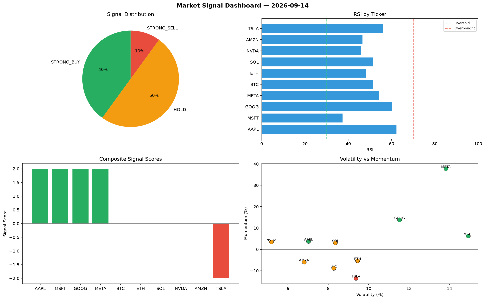

# Market Signal Report — 2026-09-14

**Run ID:** `80ba430e6a` | **Buy:** 4 | **Sell:** 1 | **Hold:** 5

## Signal Dashboard

| Ticker | Price | Signal | Score | RSI | Momentum | Confidence |
|--------|-------|--------|-------|-----|----------|------------|
| AAPL | $649.99 | **STRONG_BUY** | 2 | 62.32 | 0.0372 | 0.5 |
| MSFT | $3614.17 | **STRONG_BUY** | 2 | 37.37 | 0.0624 | 0.5 |
| GOOG | $4006.13 | **STRONG_BUY** | 2 | 60.18 | 0.1378 | 0.5 |
| META | $3391.13 | **STRONG_BUY** | 2 | 54.3 | 0.3776 | 0.5 |
| BTC | $1462.41 | **HOLD** | 0 | 51.58 | -0.0888 | 0.0 |
| ETH | $3937.5 | **HOLD** | 0 | 48.38 | -0.0534 | 0.0 |
| SOL | $2087.15 | **HOLD** | 0 | 51.29 | 0.0306 | 0.0 |
| NVDA | $4560.83 | **HOLD** | 0 | 45.75 | 0.0348 | 0.0 |
| AMZN | $233.16 | **HOLD** | 0 | 46.62 | -0.0597 | 0.0 |
| TSLA | $996.43 | **STRONG_SELL** | -2 | 55.88 | -0.1356 | 0.5 |

## Delta vs Yesterday

| Ticker | Today | Yesterday | Price Change | Signal Changed |
|--------|-------|-----------|-------------|----------------|
| AAPL | STRONG_BUY | BUY | 📉 -84.47% | ⚠️ YES |
| MSFT | STRONG_BUY | STRONG_SELL | 📈 382.89% | ⚠️ YES |
| GOOG | STRONG_BUY | STRONG_BUY | 📈 80.8% | — |
| META | STRONG_BUY | SELL | 📈 209.73% | ⚠️ YES |
| BTC | HOLD | SELL | 📉 -3.02% | ⚠️ YES |
| ETH | HOLD | STRONG_SELL | 📈 308.55% | ⚠️ YES |
| SOL | HOLD | STRONG_SELL | 📉 -18.87% | ⚠️ YES |
| NVDA | HOLD | STRONG_SELL | 📈 361.4% | ⚠️ YES |
| AMZN | HOLD | STRONG_BUY | 📉 -78.89% | ⚠️ YES |
| TSLA | STRONG_SELL | STRONG_SELL | 📈 124.59% | — |