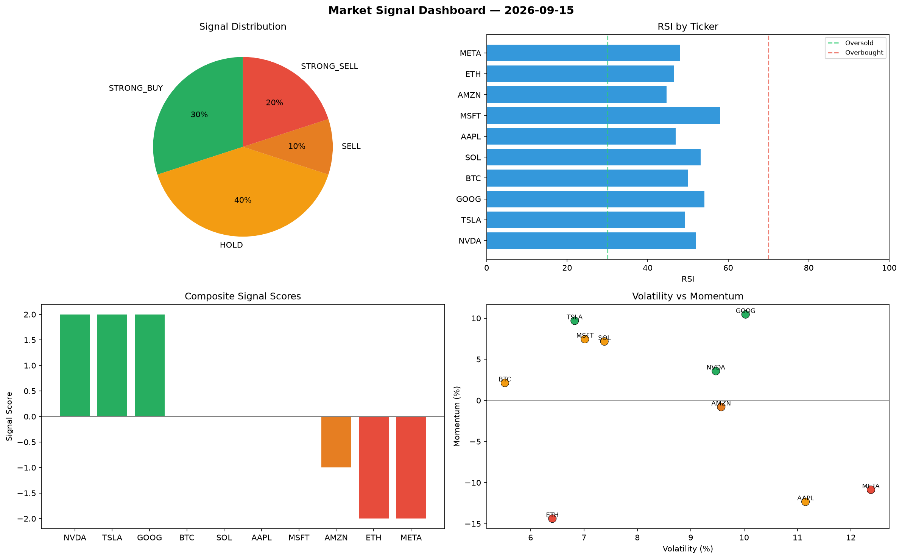

# Market Signal Report — 2026-09-15

**Run ID:** `d1d7387c15` | **Buy:** 3 | **Sell:** 3 | **Hold:** 4

## Signal Dashboard

| Ticker | Price | Signal | Score | RSI | Momentum | Confidence |
|--------|-------|--------|-------|-----|----------|------------|
| NVDA | $889.19 | **STRONG_BUY** | 2 | 52.07 | 0.0357 | 0.5 |
| TSLA | $3638.89 | **STRONG_BUY** | 2 | 49.19 | 0.0969 | 0.5 |
| GOOG | $680.79 | **STRONG_BUY** | 2 | 54.09 | 0.1046 | 0.5 |
| BTC | $1598.36 | **HOLD** | 0 | 50.08 | 0.0213 | 0.0 |
| SOL | $535.72 | **HOLD** | 0 | 53.15 | 0.0717 | 0.0 |
| AAPL | $3129.62 | **HOLD** | 0 | 46.96 | -0.1233 | 0.0 |
| MSFT | $2930.81 | **HOLD** | 0 | 57.99 | 0.0745 | 0.0 |
| AMZN | $2871.14 | **SELL** | -1 | 44.66 | -0.008 | 0.25 |
| ETH | $1628.18 | **STRONG_SELL** | -2 | 46.56 | -0.1438 | 0.5 |
| META | $4010.94 | **STRONG_SELL** | -2 | 48.05 | -0.1087 | 0.5 |

## Delta vs Yesterday

| Ticker | Today | Yesterday | Price Change | Signal Changed |
|--------|-------|-----------|-------------|----------------|
| NVDA | STRONG_BUY | HOLD | 📉 -43.83% | ⚠️ YES |
| TSLA | STRONG_BUY | STRONG_BUY | 📉 -4.77% | — |
| GOOG | STRONG_BUY | HOLD | 📉 -76.72% | ⚠️ YES |
| BTC | HOLD | HOLD | 📈 11.62% | — |
| SOL | HOLD | HOLD | 📉 -83.59% | — |
| AAPL | HOLD | HOLD | 📉 -37.72% | — |
| MSFT | HOLD | STRONG_SELL | 📉 -34.36% | ⚠️ YES |
| AMZN | SELL | STRONG_BUY | 📉 -34.4% | ⚠️ YES |
| ETH | STRONG_SELL | STRONG_BUY | 📉 -62.02% | ⚠️ YES |
| META | STRONG_SELL | SELL | 📉 -13.93% | ⚠️ YES |