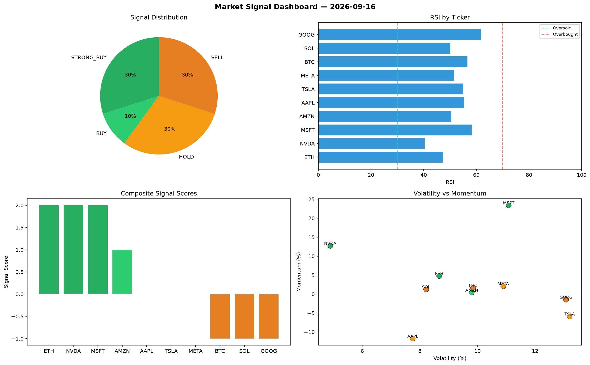

# Market Signal Report — 2026-09-16

**Run ID:** `233a63f634` | **Buy:** 4 | **Sell:** 3 | **Hold:** 3

## Signal Dashboard

| Ticker | Price | Signal | Score | RSI | Momentum | Confidence |
|--------|-------|--------|-------|-----|----------|------------|
| ETH | $3602.17 | **STRONG_BUY** | 2 | 47.3 | 0.0477 | 0.5 |
| NVDA | $86.21 | **STRONG_BUY** | 2 | 40.42 | 0.1272 | 0.5 |
| MSFT | $2662.95 | **STRONG_BUY** | 2 | 58.36 | 0.2341 | 0.5 |
| AMZN | $4131.2 | **BUY** | 1 | 50.52 | 0.0039 | 0.25 |
| AAPL | $872.12 | **HOLD** | 0 | 55.38 | -0.1173 | 0.0 |
| TSLA | $4854.88 | **HOLD** | 0 | 55.04 | -0.0588 | 0.0 |
| META | $2037.73 | **HOLD** | 0 | 51.47 | 0.0209 | 0.0 |
| BTC | $3932.38 | **SELL** | -1 | 56.66 | 0.0164 | 0.25 |
| SOL | $4872.35 | **SELL** | -1 | 50.17 | 0.0127 | 0.25 |
| GOOG | $4041.9 | **SELL** | -1 | 61.82 | -0.0147 | 0.25 |

## Delta vs Yesterday

| Ticker | Today | Yesterday | Price Change | Signal Changed |
|--------|-------|-----------|-------------|----------------|
| ETH | STRONG_BUY | STRONG_SELL | 📈 689.33% | ⚠️ YES |
| NVDA | STRONG_BUY | HOLD | 📉 -93.96% | ⚠️ YES |
| MSFT | STRONG_BUY | STRONG_BUY | 📉 -31.41% | — |
| AMZN | BUY | STRONG_BUY | 📉 -20.91% | ⚠️ YES |
| AAPL | HOLD | HOLD | 📉 -30.42% | — |
| TSLA | HOLD | BUY | 📈 91.15% | ⚠️ YES |
| META | HOLD | STRONG_SELL | 📈 13.08% | ⚠️ YES |
| BTC | SELL | STRONG_SELL | 📈 267.91% | ⚠️ YES |
| SOL | SELL | STRONG_BUY | 📈 376.79% | ⚠️ YES |
| GOOG | SELL | STRONG_BUY | 📉 -2.88% | ⚠️ YES |