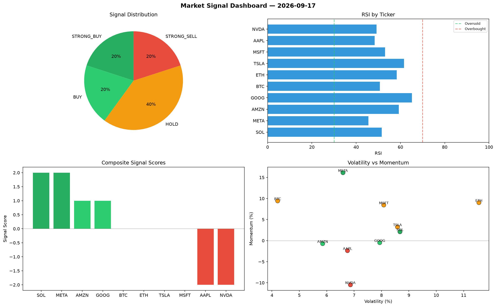

# Market Signal Report — 2026-09-17

**Run ID:** `4fb2a6d12c` | **Buy:** 4 | **Sell:** 2 | **Hold:** 4

## Signal Dashboard

| Ticker | Price | Signal | Score | RSI | Momentum | Confidence |
|--------|-------|--------|-------|-----|----------|------------|
| SOL | $2104.32 | **STRONG_BUY** | 2 | 51.53 | 0.021 | 0.5 |
| META | $4876.12 | **STRONG_BUY** | 2 | 45.5 | 0.1613 | 0.5 |
| AMZN | $1184.21 | **BUY** | 1 | 59.31 | -0.0072 | 0.25 |
| GOOG | $2920.47 | **BUY** | 1 | 65.18 | -0.0048 | 0.25 |
| BTC | $1245.21 | **HOLD** | 0 | 50.67 | 0.0943 | 0.0 |
| ETH | $2021.67 | **HOLD** | 0 | 58.33 | 0.0902 | 0.0 |
| TSLA | $4893.71 | **HOLD** | 0 | 61.63 | 0.0324 | 0.0 |
| MSFT | $3271.2 | **HOLD** | 0 | 53.02 | 0.0845 | 0.0 |
| AAPL | $4374.27 | **STRONG_SELL** | -2 | 48.32 | -0.0238 | 0.5 |
| NVDA | $2370.57 | **STRONG_SELL** | -2 | 49.19 | -0.1049 | 0.5 |

## Delta vs Yesterday

| Ticker | Today | Yesterday | Price Change | Signal Changed |
|--------|-------|-----------|-------------|----------------|
| SOL | STRONG_BUY | STRONG_SELL | 📈 73.87% | ⚠️ YES |
| META | STRONG_BUY | STRONG_SELL | 📈 2180.8% | ⚠️ YES |
| AMZN | BUY | STRONG_SELL | 📉 -41.16% | ⚠️ YES |
| GOOG | BUY | SELL | 📈 7161.24% | ⚠️ YES |
| BTC | HOLD | STRONG_SELL | 📉 -37.06% | ⚠️ YES |
| ETH | HOLD | STRONG_SELL | 📉 -25.37% | ⚠️ YES |
| TSLA | HOLD | STRONG_BUY | 📈 89.05% | ⚠️ YES |
| MSFT | HOLD | STRONG_SELL | 📉 -9.16% | ⚠️ YES |
| AAPL | STRONG_SELL | BUY | 📈 227.09% | ⚠️ YES |
| NVDA | STRONG_SELL | STRONG_BUY | 📈 1032.08% | ⚠️ YES |