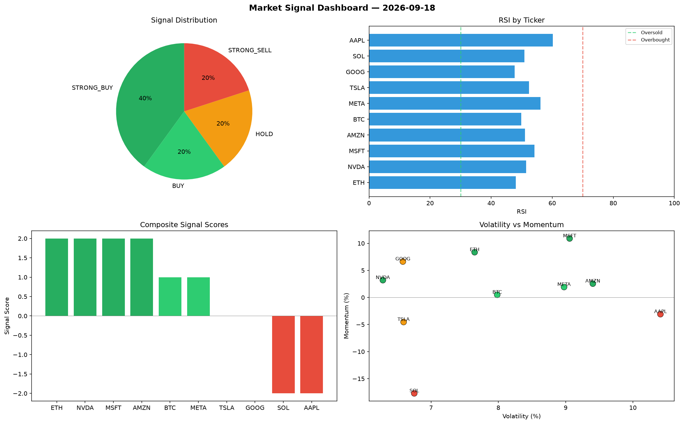

# Market Signal Report — 2026-09-18

**Run ID:** `1b10634e3c` | **Buy:** 6 | **Sell:** 2 | **Hold:** 2

## Signal Dashboard

| Ticker | Price | Signal | Score | RSI | Momentum | Confidence |
|--------|-------|--------|-------|-----|----------|------------|
| ETH | $3329.65 | **STRONG_BUY** | 2 | 48.08 | 0.0835 | 0.5 |
| NVDA | $1201.05 | **STRONG_BUY** | 2 | 51.49 | 0.0319 | 0.5 |
| MSFT | $5233.84 | **STRONG_BUY** | 2 | 54.17 | 0.1089 | 0.5 |
| AMZN | $4319.47 | **STRONG_BUY** | 2 | 51.06 | 0.0255 | 0.5 |
| BTC | $4071.42 | **BUY** | 1 | 49.84 | 0.0049 | 0.25 |
| META | $864.38 | **BUY** | 1 | 56.15 | 0.0192 | 0.25 |
| TSLA | $4722.33 | **HOLD** | 0 | 52.39 | -0.0454 | 0.0 |
| GOOG | $2690.69 | **HOLD** | 0 | 47.66 | 0.0663 | 0.0 |
| SOL | $4227.17 | **STRONG_SELL** | -2 | 50.93 | -0.1771 | 0.5 |
| AAPL | $795.51 | **STRONG_SELL** | -2 | 60.24 | -0.0309 | 0.5 |

## Delta vs Yesterday

| Ticker | Today | Yesterday | Price Change | Signal Changed |
|--------|-------|-----------|-------------|----------------|
| ETH | STRONG_BUY | STRONG_SELL | 📈 373.86% | ⚠️ YES |
| NVDA | STRONG_BUY | STRONG_SELL | 📉 -67.1% | ⚠️ YES |
| MSFT | STRONG_BUY | SELL | 📈 47.68% | ⚠️ YES |
| AMZN | STRONG_BUY | STRONG_SELL | 📈 170.46% | ⚠️ YES |
| BTC | BUY | STRONG_SELL | 📈 44.26% | ⚠️ YES |
| META | BUY | SELL | 📉 -81.53% | ⚠️ YES |
| TSLA | HOLD | STRONG_SELL | 📈 133.59% | ⚠️ YES |
| GOOG | HOLD | STRONG_BUY | 📈 531.65% | ⚠️ YES |
| SOL | STRONG_SELL | BUY | 📉 -2.66% | ⚠️ YES |
| AAPL | STRONG_SELL | STRONG_SELL | 📈 481.6% | — |