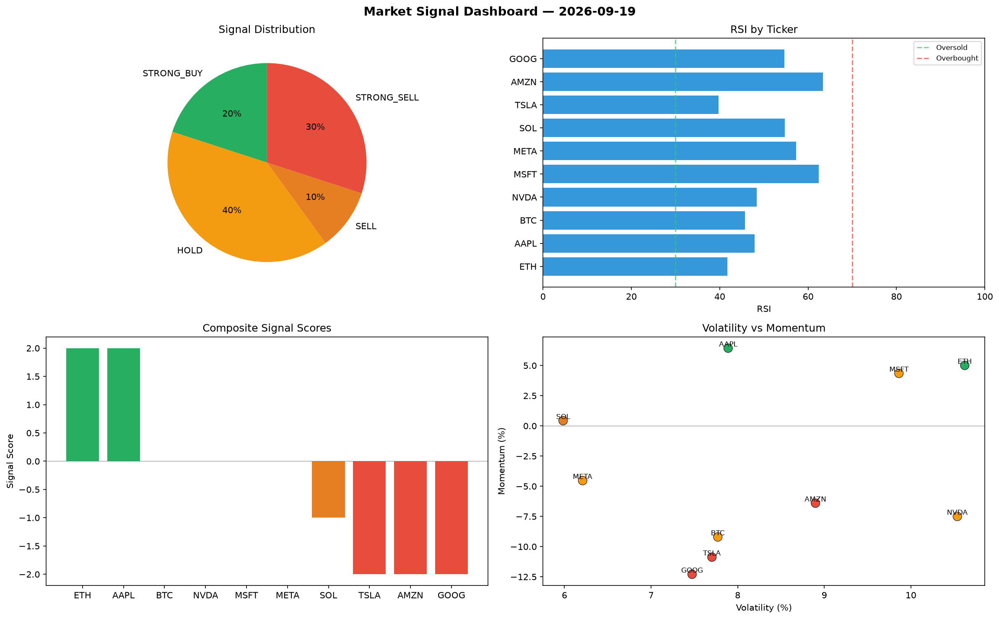

# Market Signal Report — 2026-09-19

**Run ID:** `05849af231` | **Buy:** 2 | **Sell:** 4 | **Hold:** 4

## Signal Dashboard

| Ticker | Price | Signal | Score | RSI | Momentum | Confidence |
|--------|-------|--------|-------|-----|----------|------------|
| ETH | $4994.48 | **STRONG_BUY** | 2 | 41.71 | 0.0501 | 0.5 |
| AAPL | $2378.72 | **STRONG_BUY** | 2 | 47.85 | 0.0644 | 0.5 |
| BTC | $1230.7 | **HOLD** | 0 | 45.75 | -0.092 | 0.0 |
| NVDA | $3954.34 | **HOLD** | 0 | 48.39 | -0.075 | 0.0 |
| MSFT | $4317.37 | **HOLD** | 0 | 62.38 | 0.0435 | 0.0 |
| META | $4485.88 | **HOLD** | 0 | 57.31 | -0.0453 | 0.0 |
| SOL | $230.49 | **SELL** | -1 | 54.74 | 0.0043 | 0.25 |
| TSLA | $1227.47 | **STRONG_SELL** | -2 | 39.71 | -0.1087 | 0.5 |
| AMZN | $2957.69 | **STRONG_SELL** | -2 | 63.34 | -0.064 | 0.5 |
| GOOG | $2245.56 | **STRONG_SELL** | -2 | 54.62 | -0.1229 | 0.5 |

## Delta vs Yesterday

| Ticker | Today | Yesterday | Price Change | Signal Changed |
|--------|-------|-----------|-------------|----------------|
| ETH | STRONG_BUY | HOLD | 📈 59.41% | ⚠️ YES |
| AAPL | STRONG_BUY | STRONG_BUY | 📉 -48.33% | — |
| BTC | HOLD | STRONG_SELL | 📉 -3.05% | ⚠️ YES |
| NVDA | HOLD | STRONG_BUY | 📈 26.7% | ⚠️ YES |
| MSFT | HOLD | STRONG_BUY | 📈 113.4% | ⚠️ YES |
| META | HOLD | SELL | 📈 2196.68% | ⚠️ YES |
| SOL | SELL | BUY | 📉 -88.01% | ⚠️ YES |
| TSLA | STRONG_SELL | SELL | 📉 -73.48% | ⚠️ YES |
| AMZN | STRONG_SELL | STRONG_BUY | 📈 25.65% | ⚠️ YES |
| GOOG | STRONG_SELL | SELL | 📉 -53.59% | ⚠️ YES |