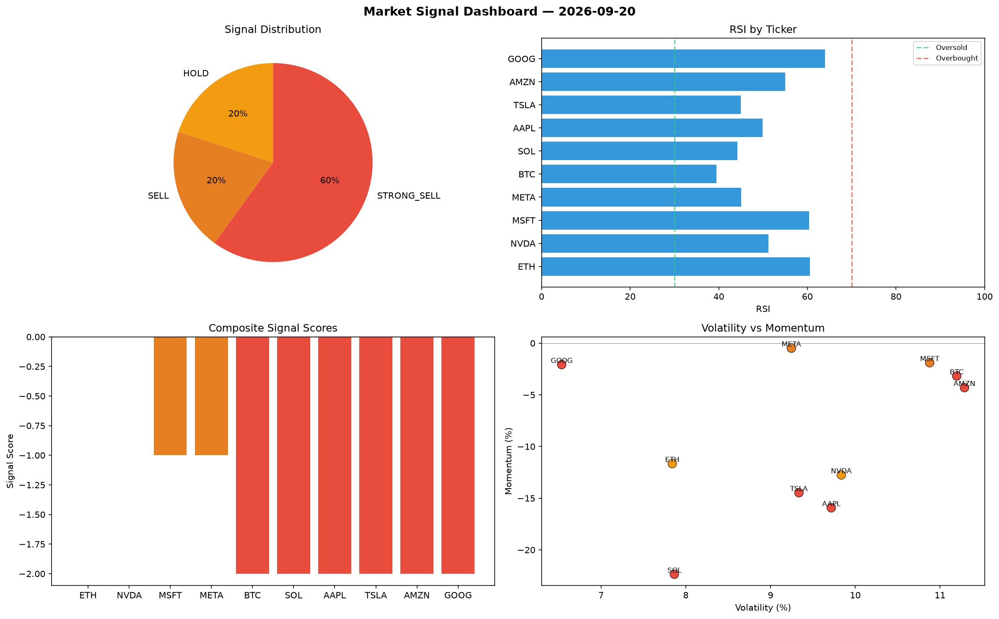

# Market Signal Report — 2026-09-20

**Run ID:** `1ebe782fdd` | **Buy:** 0 | **Sell:** 8 | **Hold:** 2

## Signal Dashboard

| Ticker | Price | Signal | Score | RSI | Momentum | Confidence |
|--------|-------|--------|-------|-----|----------|------------|
| ETH | $4093.12 | **HOLD** | 0 | 60.57 | -0.1165 | 0.0 |
| NVDA | $2284.99 | **HOLD** | 0 | 51.16 | -0.1275 | 0.0 |
| MSFT | $3817.44 | **SELL** | -1 | 60.38 | -0.0189 | 0.25 |
| META | $2581.7 | **SELL** | -1 | 45.01 | -0.0048 | 0.25 |
| BTC | $1643.01 | **STRONG_SELL** | -2 | 39.51 | -0.0317 | 0.5 |
| SOL | $3006.73 | **STRONG_SELL** | -2 | 44.17 | -0.2236 | 0.5 |
| AAPL | $1183.73 | **STRONG_SELL** | -2 | 49.87 | -0.1593 | 0.5 |
| TSLA | $3081.62 | **STRONG_SELL** | -2 | 44.92 | -0.1447 | 0.5 |
| AMZN | $3540.81 | **STRONG_SELL** | -2 | 54.97 | -0.043 | 0.5 |
| GOOG | $4207.07 | **STRONG_SELL** | -2 | 63.99 | -0.0207 | 0.5 |

## Delta vs Yesterday

| Ticker | Today | Yesterday | Price Change | Signal Changed |
|--------|-------|-----------|-------------|----------------|
| ETH | HOLD | HOLD | 📈 23.31% | — |
| NVDA | HOLD | STRONG_BUY | 📉 -28.11% | ⚠️ YES |
| MSFT | SELL | BUY | 📈 140.66% | ⚠️ YES |
| META | SELL | HOLD | 📈 167.21% | ⚠️ YES |
| BTC | STRONG_SELL | STRONG_SELL | 📉 -56.53% | — |
| SOL | STRONG_SELL | STRONG_SELL | 📉 -10.43% | — |
| AAPL | STRONG_SELL | STRONG_BUY | 📉 -65.0% | ⚠️ YES |
| TSLA | STRONG_SELL | STRONG_SELL | 📈 7.14% | — |
| AMZN | STRONG_SELL | STRONG_SELL | 📈 748.16% | — |
| GOOG | STRONG_SELL | STRONG_SELL | 📈 9.04% | — |