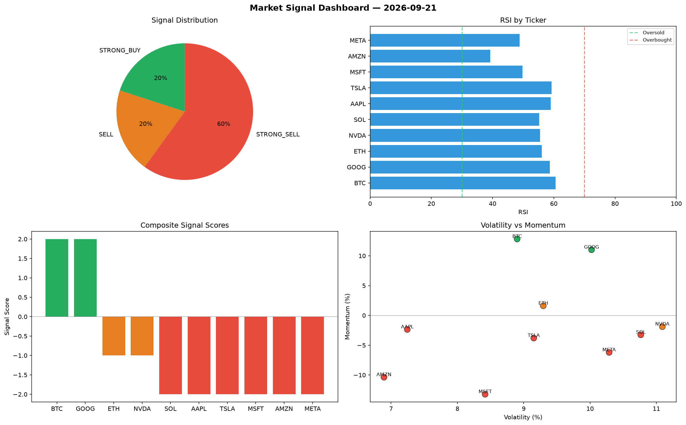

# Market Signal Report — 2026-09-21

**Run ID:** `6d17d491c7` | **Buy:** 2 | **Sell:** 8 | **Hold:** 0

## Signal Dashboard

| Ticker | Price | Signal | Score | RSI | Momentum | Confidence |
|--------|-------|--------|-------|-----|----------|------------|
| BTC | $4135.54 | **STRONG_BUY** | 2 | 60.54 | 0.1281 | 0.5 |
| GOOG | $4713.83 | **STRONG_BUY** | 2 | 58.66 | 0.1101 | 0.5 |
| ETH | $2761.16 | **SELL** | -1 | 56.05 | 0.0161 | 0.25 |
| NVDA | $3098.59 | **SELL** | -1 | 55.54 | -0.0189 | 0.25 |
| SOL | $753.77 | **STRONG_SELL** | -2 | 55.27 | -0.0326 | 0.5 |
| AAPL | $4518.39 | **STRONG_SELL** | -2 | 59.01 | -0.0236 | 0.5 |
| TSLA | $655.72 | **STRONG_SELL** | -2 | 59.26 | -0.038 | 0.5 |
| MSFT | $2373.95 | **STRONG_SELL** | -2 | 49.78 | -0.1323 | 0.5 |
| AMZN | $2025.34 | **STRONG_SELL** | -2 | 39.28 | -0.1037 | 0.5 |
| META | $1568.76 | **STRONG_SELL** | -2 | 48.86 | -0.0621 | 0.5 |

## Delta vs Yesterday

| Ticker | Today | Yesterday | Price Change | Signal Changed |
|--------|-------|-----------|-------------|----------------|
| BTC | STRONG_BUY | STRONG_BUY | 📉 -18.66% | — |
| GOOG | STRONG_BUY | HOLD | 📈 223.24% | ⚠️ YES |
| ETH | SELL | HOLD | 📉 -16.19% | ⚠️ YES |
| NVDA | SELL | BUY | 📉 -34.5% | ⚠️ YES |
| SOL | STRONG_SELL | STRONG_SELL | 📉 -51.3% | — |
| AAPL | STRONG_SELL | STRONG_SELL | 📈 155.88% | — |
| TSLA | STRONG_SELL | STRONG_BUY | 📉 -77.13% | ⚠️ YES |
| MSFT | STRONG_SELL | SELL | 📈 284.26% | ⚠️ YES |
| AMZN | STRONG_SELL | HOLD | 📈 247.03% | ⚠️ YES |
| META | STRONG_SELL | STRONG_SELL | 📈 34.63% | — |